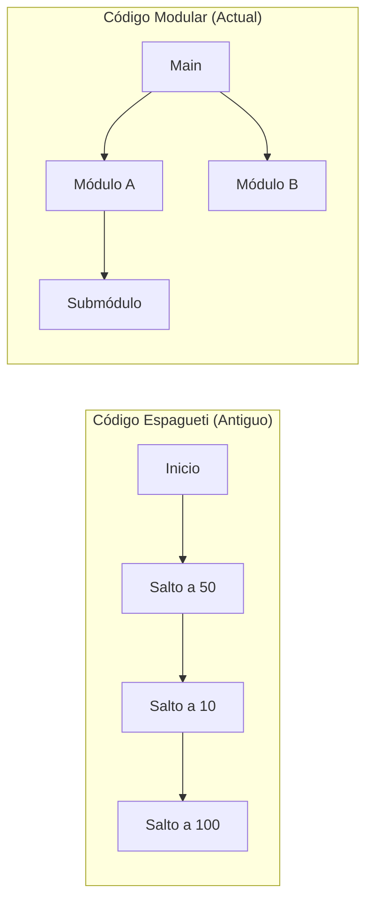

- [1. Introducción](#1-introducción)
  - [¿Por qué Programación Estructurada y Modular?](#por-qué-programación-estructurada-y-modular)

# 1. Introducción
En este tema vamos a ver los conceptos básicos de la programación estructurada y modular. Estos conceptos son fundamentales para entender cómo se programan los ordenadores y cómo se pueden resolver problemas de forma eficiente y clara.

Son los primeros paradigmas de programación que debemos aprender y dominar, ya que son la base para entender otros paradigmas más avanzados como la programación orientada a objetos o la programación funcional. Con ello vamos a dotar de comportamiento imperativo, es decir, vamos a indicarle al ordenador qué hacer y cómo hacerlo, paso a paso y darle vida a nuestros algoritmos.

## ¿Por qué Programación Estructurada y Modular?
Antes de este paradigma, el código fluía de forma desordenada mediante saltos incondicionales (`GOTO`), lo que se conocía como **Código Espagueti**. Un programa estructurado y modular es como una empresa bien organizada: cada departamento (módulo) tiene una función clara y existen protocolos (estructuras) para tomar decisiones y repetir procesos.

