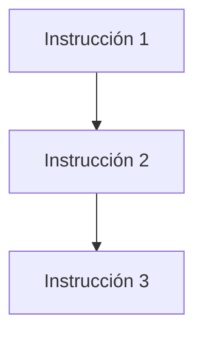
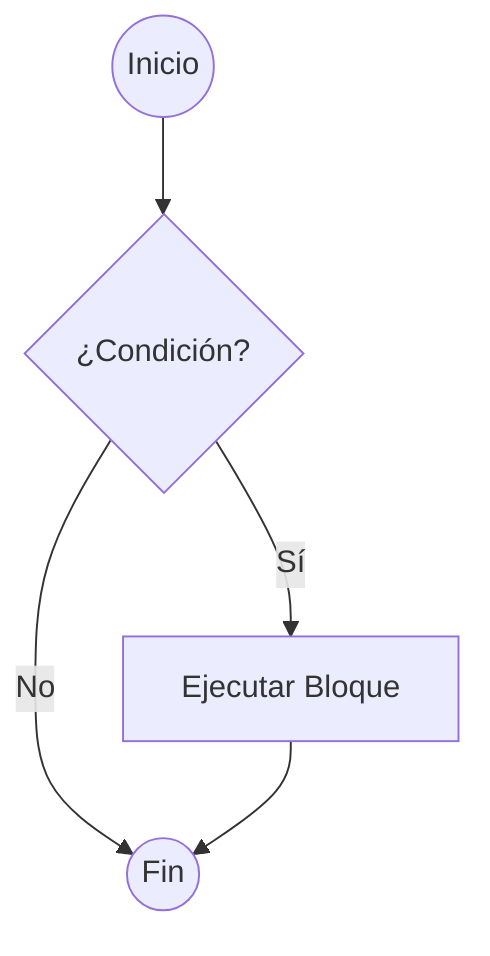
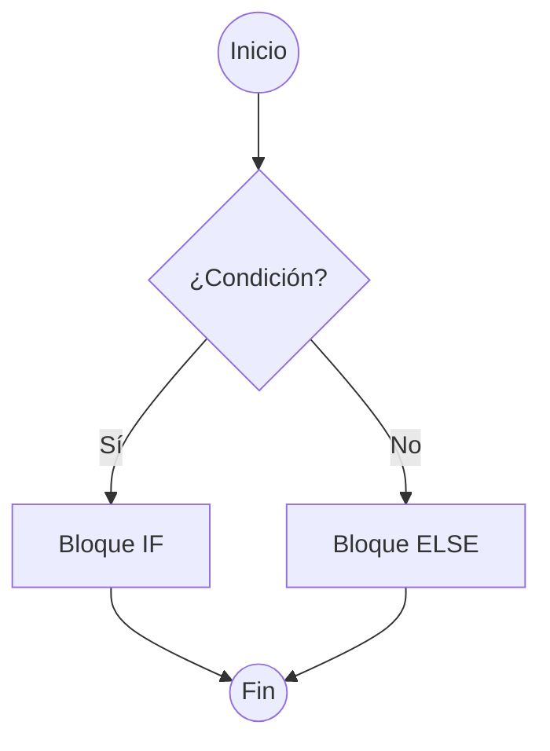
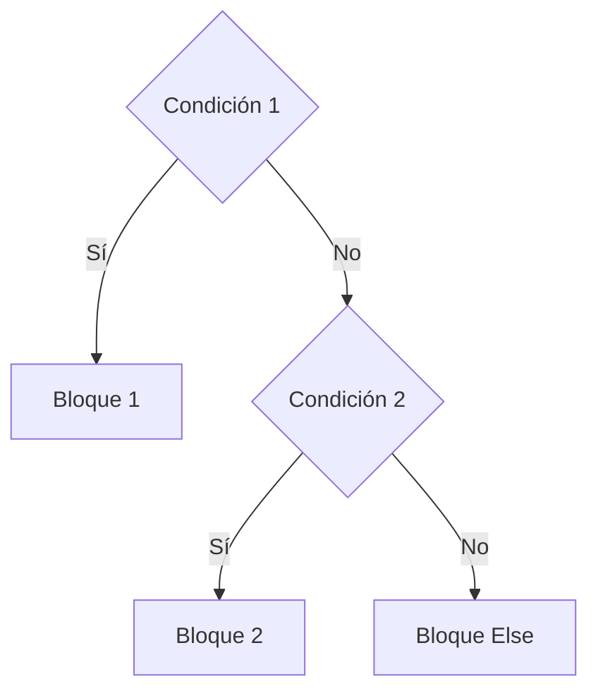
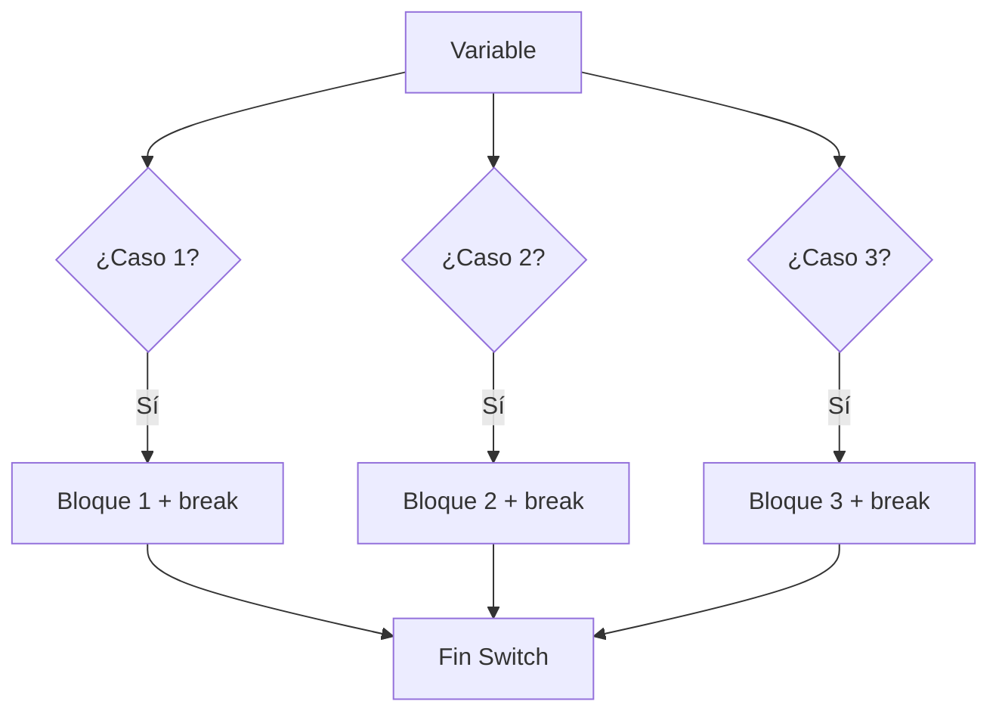
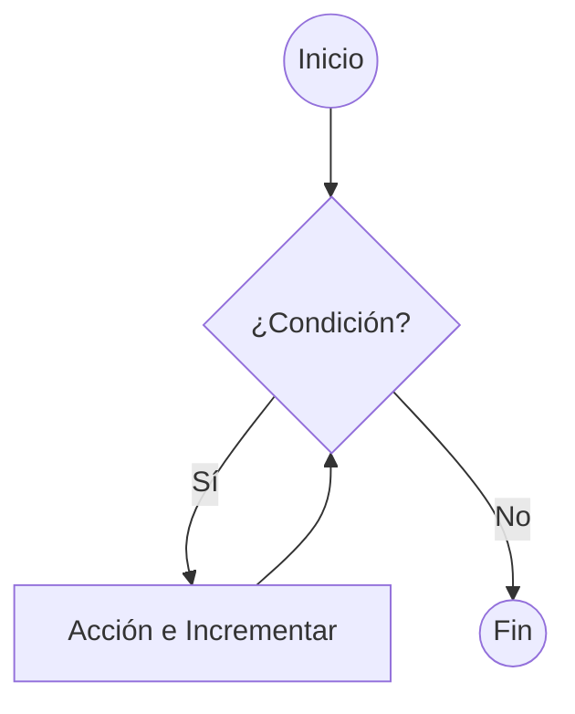
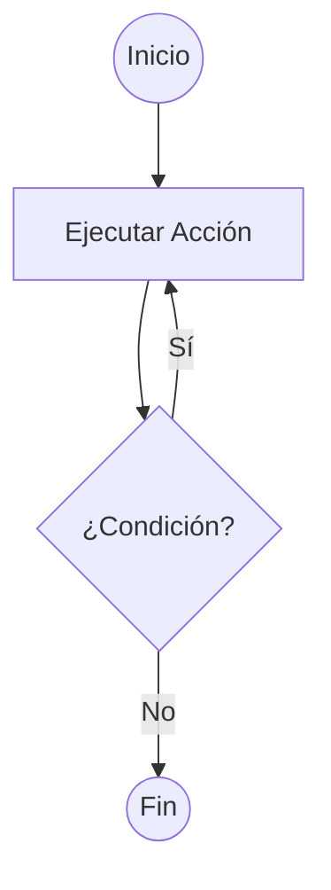
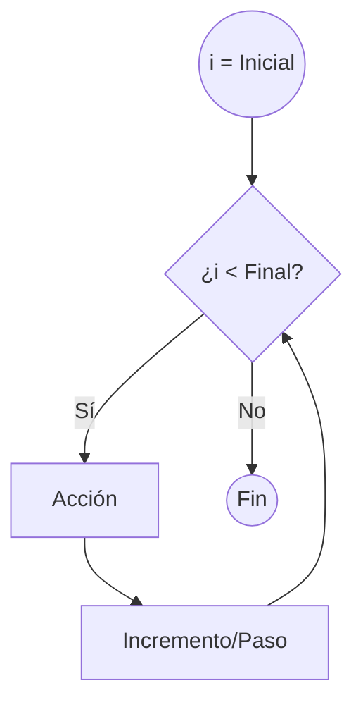
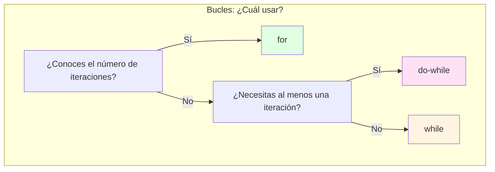

- [2. Programación Estructurada](#2-programación-estructurada)
  - [2.1. Secuencias](#21-secuencias)
  - [2.2. Condicionales](#22-condicionales)
  - [2.3. Bucles](#23-bucles)
  - [2.4. Mecanismos de Control de Bucles](#24-mecanismos-de-control-de-bucles)
    - [A. Bucles controlados por Indicadores (Banderas o Flags)](#a-bucles-controlados-por-indicadores-banderas-o-flags)
    - [B. Bucles controlados por Centinela](#b-bucles-controlados-por-centinela)
    - [C. Bucles Anidados](#c-bucles-anidados)
  - [2.5. Peligros: El Bucle Infinito](#25-peligros-el-bucle-infinito)


# 2. Programación Estructurada

La **programación estructurada** es un paradigma que busca crear programas más claros y fáciles de mantener. Se basa en el **Teorema de la programación estructurada**, que demuestra que cualquier algoritmo puede ser implementado utilizando únicamente tres estructuras de control básicas:

1.  **Secuencia**: Las instrucciones se ejecutan una después de la otra, en el orden en que están escritas.
2.  **Condicional (o Selección)**: Se ejecuta un bloque de código u otro dependiendo de si se cumple o no una condición.
3.  **Bucle (o Iteración)**: Un bloque de código se repite mientras se cumpla una determinada condición.

**Principio DRY (Don't Repeat Yourself)**:
Como profesores, insistimos en que un buen programador no se repite. Si ves que estás copiando y pegando el mismo bloque de código varias veces, es una señal de que necesitas una estructura de control (bucle) o un módulo (función). ¡Aplica DRY desde el primer día!


## 2.1. Secuencias

Es la estructura más simple. El programa ejecuta las instrucciones de arriba hacia abajo, una por una. Es la forma más básica de controlar el flujo de un programa, una instrucción tras otra.



```csharp
Main {
    // Ejemplo de Secuencia
    writeLine("Hola");
    writeLine("¿Cómo estás?");

    // Leemos el nombre del usuario
    writeLine("Por favor, introduce tu nombre:");
    string nombre = readLine();

    // Mostramos un saludo personalizado
    writeLine("Encantado de conocerte, " + nombre);
}
```

## 2.2. Condicionales

Permiten que nuestro programa tome decisiones y se comporte de manera diferente según las circunstancias.

  * **Condicional simple (`if`)**: Evalúa una condición booleana (verdadero o falso). Si la condición es verdadera, se ejecuta el bloque de código dentro del `if`. Si es falsa, se salta ese bloque y continúa con el resto del programa.



```csharp
Main {
    // Condicional simple
    var edad = 20;
    if (edad >= 18) {
        writeLine("Eres mayor de edad.");
    }
}
```

  * **Condicional compuesto (`if-else`)**: Permite ejecutar un bloque de código si se cumple una condición y otro bloque si no se cumple.



```csharp
Main {
    // Condicional compuesto
    var edad = 16;
    if (edad >= 18) {
        writeLine("Eres mayor de edad.");
    } else {
        writeLine("Eres menor de edad.");
    }
}
```

  * **Condicionales múltiples (`if-else if-else`)**: Permiten encadenar varias condiciones. El programa evalúa las condiciones en orden y ejecuta el bloque de la primera que sea verdadera. Si ninguna lo es, se ejecuta el bloque `else` final (si existe).



```csharp
Main {
    // Condicionales múltiples
    var edadAlumno = 16;
    if (edadAlumno >= 18) {
        writeLine("Eres mayor de edad.");
    } else if (edadAlumno >= 16) {
        writeLine("Casi eres mayor de edad.");
    } else {
        writeLine("Eres menor de edad.");
    }
}
```

  * **Estructura `switch`**: Cuando necesitamos comparar una única variable contra múltiples valores posibles, usar una cadena larga de `if-else if` puede ser engorroso y poco legible (efecto "cascada"). La estructura `switch` (o `según` en pseudocódigo) ofrece una alternativa mucho más limpia y organizada. Evalúa una expresión y ejecuta el bloque de código (`case`) que coincida con el valor. Es obligatorio incluir una sección `default` para manejar los casos en que ninguno de los valores coincide.



```csharp
Main {
    // Ejemplo de switch para los días de la semana
    var dia = 3; // Suponemos que 1 es Lunes, 2 es Martes, etc.
    string nombreDelDia;

    switch (dia) {
        case 1:
            nombreDelDia = "Lunes";
            break; // 'break' es crucial para salir del switch
        case 2:
            nombreDelDia = "Martes";
            break;
        case 3:
            nombreDelDia = "Miércoles";
            break;
        case 4:
            nombreDelDia = "Jueves";
            break;
        case 5:
            nombreDelDia = "Viernes";
            break;
        case 6:
        case 7:
            nombreDelDia = "Fin de semana";
            break; // Se pueden agrupar casos
        default:
            nombreDelDia = "Día inválido";
            break;
    }
    writeLine("Hoy es: " + nombreDelDia); // Imprimirá "Hoy es: Miércoles"
}
```

Una de las técnicas más útiles para evitar errores comunes en los condicionales es el uso de **paréntesis** para agrupar condiciones complejas. Esto mejora la legibilidad y asegura que las condiciones se evalúan en el orden correcto.

```csharp
Main {
    var edad = 20;
    var tieneDNI = true;
    // Uso de paréntesis para mayor claridad
    if ((edad >= 18) && (tieneDNI)) {
        writeLine("Puedes votar.");
    } else {
        writeLine("No puedes votar.");
    }
}
```

## 2.3. Bucles

Los bucles nos permiten repetir un bloque de código varias veces, ahorrándonos escribir la misma lógica una y otra vez.

   * **Bucles indefinidos (`while` y `do-while`)**: Se ejecutan mientras se cumpla una condición. Son útiles cuando no sabemos cuántas iteraciones se necesitarán. `while` evalúa la condición antes de cada iteración, mientras que `do-while` la evalúa después, garantizando al menos una ejecución.

**While:**


```csharp
Main {
    // Ejemplo de bucle while
    var contador = 0;
    while (contador < 5) {
        writeLine("Contador: " + contador);
        contador = contador + 1; // Incrementamos el contador
    }
}
```

**Do-While:**


```csharp
Main {
    // Ejemplo de bucle do-while
    var opcion;
    do {
        writeLine("Menú:");
        writeLine("1. Opción 1");
        writeLine("2. Opción 2");
        writeLine("3. Salir");
        opcion = readLine();
        writeLine("Has seleccionado la opción: " + opcion);
    } while (opcion != "3");
}
```

  * **Bucles definidos (`for`)**: Los bucles definidos se utilizan cuando sabemos de antemano cuántas veces queremos repetir un bloque de código. La estructura `for` incluye la inicialización, la condición y el incremento/decremento en una sola línea.



```csharp
Main {
    // 1. Bucle 'for' ascendente de 1 en 1
    writeLine("Contando hacia adelante de 1 en 1:");
    for (int i = 0; i <= 5; i = i + 1) {
        writeLine(i); // Imprime 0, 1, 2, 3, 4, 5
    }

    // 2. Bucle 'for' descendente de 1 en 1
    writeLine("Contando hacia atrás de 1 en 1:");
    for (int i = 5; i >= 0; i = i - 1) {
        writeLine(i); // Imprime 5, 4, 3, 2, 1, 0
    }

    // 3. Bucle 'for' con saltos positivos (de 2 en 2)
    writeLine("Contando hacia adelante de 2 en 2:");
    for (int i = 0; i <= 10; i = i + 2) {
        writeLine(i); // Imprime 0, 2, 4, 6, 8, 10
    }

    // 4. Bucle 'for' con saltos negativos (de 3 en 3)
    writeLine("Contando hacia atrás de 3 en 3:");
    for (int i = 15; i >= 0; i = i - 3) {
        writeLine(i); // Imprime 15, 12, 9, 6, 3, 0
    }
}
```

## 2.4. Mecanismos de Control de Bucles

Existen **tres formas típicas** de controlar cuándo se ejecuta un bucle: bucles con contador, bucles controlados por indicadores (banderas o *flags*), y bucles controlados por centinela.

### A. Bucles controlados por Indicadores (Banderas o Flags)

Las **banderas** (*flags*) son variables que suelen ser de tipo lógico (`bool`) y se utilizan para controlar la ejecución de un bucle. Se inicializan antes del bucle y cambian de valor dentro del mismo cuando se cumple la condición de parada.

**Ejemplo 1: Estructura básica de una bandera dentro de `Main`**

```csharp
Main {
    bool continuar = true;
    while (continuar)
    {
        // ... lógica ...
        if (condicionParaAcabar)
        {
            continuar = false;
        }
    }
}
```

**Ejemplo 2: Determinar si un número contiene solo cifras menores que cinco**

```csharp
Main {
    bool menor;
    int num;

    writeLine("Introduce un número:");
    num = (int)readLine();

    menor = true; // Inicializacion del indicador

    while (menor && (num > 0))
    {
        if (num % 10 >= 5)
        {
            menor = false; // Cambiamos la bandera a false
        }
        num = num / 10; // Eliminamos la última cifra (división entera)
    }

    if (menor)
    {
        writeLine("Todas las cifras son menores que 5");
    }
    else
    {
        writeLine("Hay alguna cifra mayor o igual que 5");
    }
}
```

### B. Bucles controlados por Centinela

Los bucles controlados por centinela utilizan un **valor especial** (el centinela) que indica la parada de la iteración.

**Ejemplo: Sumar números hasta que se introduce 0 (centinela)**

```csharp
Main {
    int suma = 0;
    int num;

    writeLine("Introduce números a sumar, 0 para acabar");
    num = (int)readLine();

    while (num != 0)
    {
        suma = suma + num;
        writeLine("Introduce números a sumar, 0 para acabar");
        num = (int)readLine();
    }

    writeLine("Suma total: " + suma);
}
```

### C. Bucles Anidados

Los bucles se pueden **anidar** (un bucle dentro de otro). Esta técnica es especialmente útil para el manejo de matrices.

**Ejemplo: Generar una tabla de multiplicar (1 a 10) usando bucles `for` anidados**

```csharp
Main {
    int i, j;
    for (i = 1; i <= 10; i++)
    {
        for (j = 1; j <= 10; j++)
        {
            writeLine(i + "*" + j + "=" + (i * j));
        }
    }
}
```

## 2.5. Peligros: El Bucle Infinito
Un bucle infinito ocurre cuando la condición de salida **nunca se vuelve falsa**. 
*   *Causas comunes*: Olvidar incrementar el contador o usar una condición que siempre se cumple.
*   *Consejo*: Siempre verifica que dentro del bucle hay algo que acerque la variable de control hacia el final.

> 📝 **Nota del Profesor:** El bucle infinito es el error más común en programación estructurada. Antes de ejecutar un bucle, hazte la pregunta: "¿Cómo sale este bucle?" Si no tienes respuesta, tienes un bucle infinito.

```csharp
// ERROR COMÚN: Bucle infinito
int contador = 0;
while (contador < 10)
{
    Console.WriteLine(contador);
    // ¡Olvidaste el incremento!
    // contador NUNCA cambia → bucle infinito
}

// CORRECTO
int contador = 0;
while (contador < 10)
{
    Console.WriteLine(contador);
    contador++;  // ¡Importante!
}

// ERROR COMÚN: Condición siempre verdadera
while (true)  // Nunca sale
{
    // ...
}

// ERROR COMÚN: Condición que nunca se cumple
int opcion = 0;
while (opcion == 5)  // Si opcion empieza en 0, nunca entra
{
    // ...
}
```



> 💡 **Regla nemotécnica para bucles:**
> - **`for`**: Fijo = **F**ijo = **F**or
> - **`while`**: Mientras = **W**hile = Condición al principio
> - **`do-while`**: Hacer = **D**o = Al menos una vez

> 📝 **Tip de depuración:** Si tu programa se queda "colgado", probablemente tienes un bucle infinito. Usa el depurador para pausar y ver los valores de las variables de control del bucle.

**Comparativa visual de bucles:**

```csharp
// WHILE: Evalúa ANTES de ejecutar (puede no ejecutarse nunca)
int i = 0;
while (i < 3)
{
    Console.WriteLine($"while: {i}");
    i++;
}
// Salida: while: 0, while: 1, while: 2

// DO-WHILE: Evalúa DESPUÉS de ejecutar (siempre se ejecuta al menos una vez)
int j = 0;
do
{
    Console.WriteLine($"do-while: {j}");
    j++;
} while (j < 3);
// Salida: do-while: 0, do-while: 1, do-while: 2

// FOR: Todo junto (inicialización, condición, incremento)
for (int k = 0; k < 3; k++)
{
    Console.WriteLine($"for: {k}");
}
// Salida: for: 0, for: 1, for: 2
```
