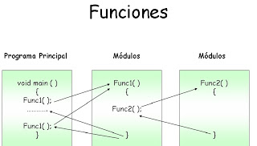
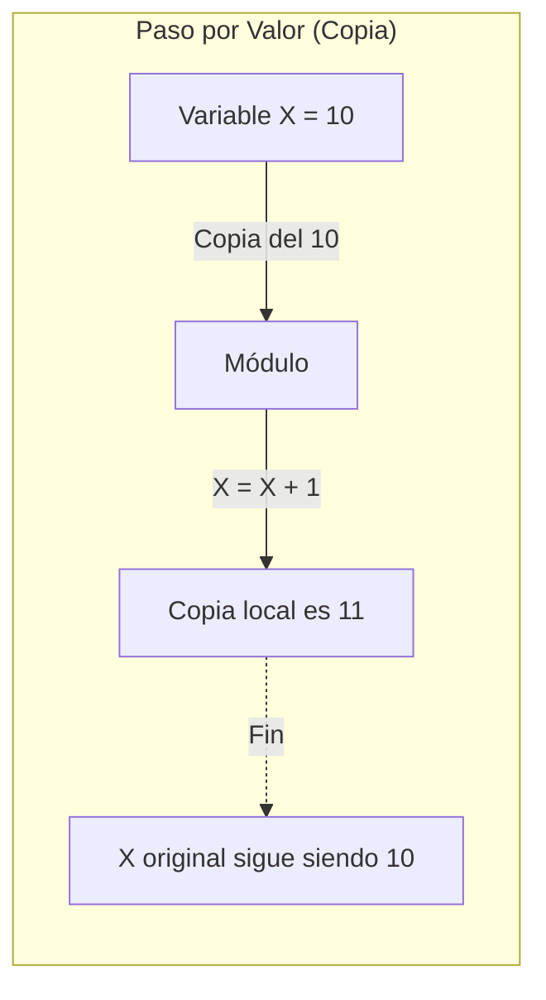
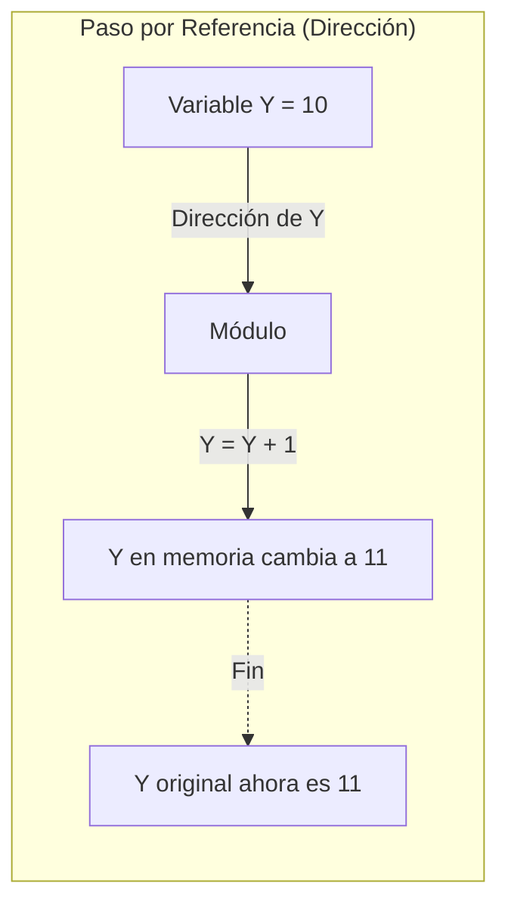
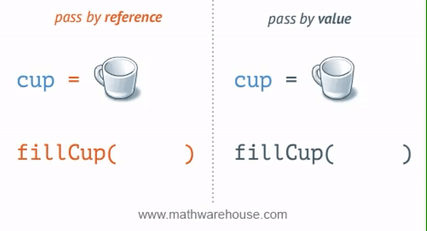
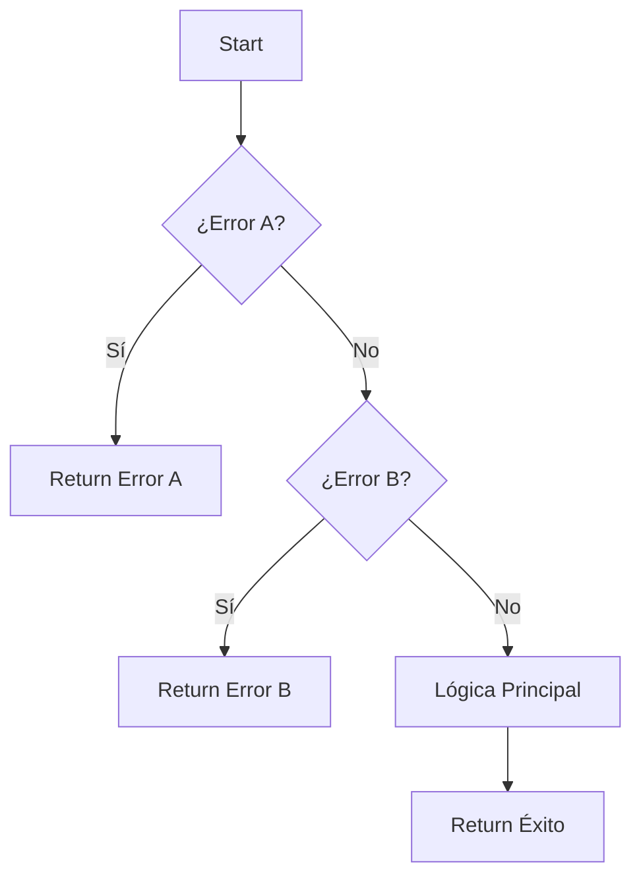
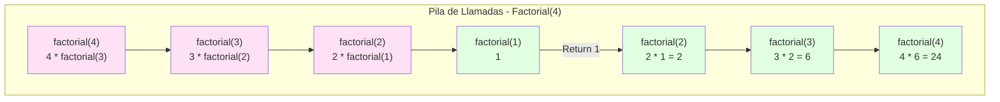
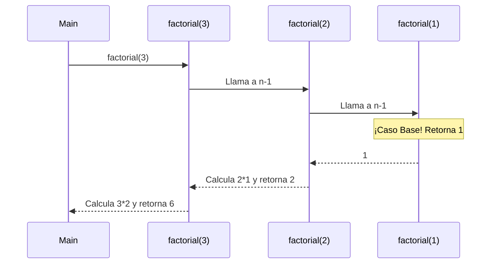

- [3. Programación Modular](#3-programación-modular)
  - [3.1. Funciones](#31-funciones)
  - [3.2. Procedimientos](#32-procedimientos)
  - [3.3. Parámetros y Argumentos](#33-parámetros-y-argumentos)
    - [3.3.1. La Regla de la Exactitud de Tipos](#331-la-regla-de-la-exactitud-de-tipos)
      - [A. Conversiones (Ampliación o Estrechamiento)](#a-conversiones-ampliación-o-estrechamiento)
    - [3.3.2. Tipos Anulables (`T?`)](#332-tipos-anulables-t)
      - [A. Pasar Tipo Base a Anulable (`T` a `T?`)](#a-pasar-tipo-base-a-anulable-t-a-t)
      - [B. Pasar Anulable a Tipo Base (`T?` a `T`)](#b-pasar-anulable-a-tipo-base-t-a-t)
    - [3.3.3. Resumen de la Regla de la Exactitud de Tipos](#333-resumen-de-la-regla-de-la-exactitud-de-tipos)
      - [1. Regla de Oro: Control Total sobre la Transformación (Tipos Diferentes)](#1-regla-de-oro-control-total-sobre-la-transformación-tipos-diferentes)
      - [2. Regla `null`: Evita Errores Inesperados](#2-regla-null-evita-errores-inesperados)
          - [A. Si vas a un contenedor flexible: ¡Paso Directo! ✅](#a-si-vas-a-un-contenedor-flexible-paso-directo-)
          - [B. Si vienes de un contenedor flexible: ¡Peligro, verifica antes! ⛔](#b-si-vienes-de-un-contenedor-flexible-peligro-verifica-antes-)
  - [3.4. Paso por valor y paso por referencia](#34-paso-por-valor-y-paso-por-referencia)
    - [¿Cuándo y por qué usar cada uno?](#cuándo-y-por-qué-usar-cada-uno)
  - [3.5. Ámbito de las variables](#35-ámbito-de-las-variables)
  - [3.6. Parámetros por defecto, opcionales y nombrados](#36-parámetros-por-defecto-opcionales-y-nombrados)
  - [3.7. Sobrecarga de funciones y procedimientos](#37-sobrecarga-de-funciones-y-procedimientos)
  - [3.8. Parámetros variables o indeterminados (`params`)](#38-parámetros-variables-o-indeterminados-params)
  - [3.9. Parámetros de salida (`out`)](#39-parámetros-de-salida-out)
  - [3.10 Reflexiones: El Contrato de la Función](#310-reflexiones-el-contrato-de-la-función)
  - [3.11. Early Return para simplificar condicionales](#311-early-return-para-simplificar-condicionales)
  - [3.12. Recursividad](#312-recursividad)
    - [El funcionamiento interno: La Pila de Llamadas (Call Stack)](#el-funcionamiento-interno-la-pila-de-llamadas-call-stack)
  - [3.13. Paquete o módulo (`using`)](#313-paquete-o-módulo-using)


# 3. Programación Modular

La **programación modular** es un paradigma que consiste en dividir un programa grande y complejo en partes más pequeñas, manejables e independientes, llamadas **módulos**. Cada módulo se encarga de una tarea específica. En el lenguaje DAW, estos módulos se implementan como **funciones** y **procedimientos**.

Las ventajas que ofrece la programación modular son:
- Facilita la resolución del problema.
- Aumenta la claridad y legibilidad de todo el programa.
- Permite que varios programadores trabajen en el mismo proyecto.
- Reduce el tiempo de desarrollo ya que se pueden reutilizar esos módulos en varios programas.
- Aumenta la fiabilidad porque es más sencillo diseñar y depurar módulos y el mantenimiento en mas fácil.

La descomposición modular se basa en la técnica “Divide y Vencerás” (DAC o Divide And Conquer), esta técnica tiene dos pasos:     
- Identificación de los subproblemas y construcción de los módulos que lo resuelven.
- Combinación de los módulos para resolver el problema original.

* **Bases de la Descomposición Modular (DAC)**
La descomposición modular sigue una serie de pasos lógicos para dividir un problema en partes más pequeñas y manejables. Estos pasos incluyen:

1. **Análisis del Problema**: Comprender a fondo el problema que se desea resolver.
2. **Identificación de Subproblemas**: Dividir el problema principal en subproblemas más simples.
3. **Diseño de Módulos**: Crear módulos (funciones o procedimientos) que resuelvan cada subproblema.
4. **Implementación**: Codificar los módulos de acuerdo con el diseño.
5. **Pruebas y Validación**: Probar cada módulo de forma independiente y en conjunto para asegurar su correcto funcionamiento.

Unos de los principios claves es el ***SRP (Single Responsibility Principle o Principio de Responsabilidad Única)***, que establece que cada módulo debe tener una única responsabilidad o función dentro del programa. Esto facilita la comprensión, el mantenimiento y la reutilización del código.

Además, podremos utilizar un enfoque ***top-down*** (de arriba hacia abajo) para diseñar el programa, comenzando con una visión general y descomponiéndola en módulos más específicos. Este enfoque ayuda a mantener el control sobre la complejidad del programa, desde una perspectiva global hasta los detalles más finos, delegando responsabilidades a cada módulo y asegurando que cada uno cumpla su función específica ensamblando luego el programa completo.

O podemos utilizar un enfoque ***bottom-up*** (de abajo hacia arriba), comenzando con módulos básicos y combinándolos para formar módulos más complejos y, finalmente, el programa completo. Este enfoque es útil cuando ya tenemos módulos reutilizables o cuando queremos construir el programa a partir de componentes existentes.

## 3.1. Funciones
Una **función** es un bloque de código que realiza una tarea específica y devuelve un valor. Las funciones pueden recibir datos de entrada (argumentos) y siempre devuelven un resultado mediante la sentencia `return`.



```csharp
function int sumar(int a, int b) {
    // Esta función toma dos enteros como argumentos y devuelve su suma.
    return a + b; // Devuelve la suma de a y b
}

Main {
    // Llamamos a la función sumar y almacenamos el resultado en la variable resultado
    int resultado = sumar(5, 3);
    writeLine("La suma es: " + resultado); // Imprime "La suma es: 8"
}
```

## 3.2. Procedimientos
Un **procedimiento** es similar a una función, pero no devuelve ningún valor. Se utiliza para ejecutar una serie de instrucciones que realizan una tarea específica. Los procedimientos pueden recibir datos de entrada (argumentos) pero no tienen una sentencia `return`.    

```csharp
procedure saludar(string nombre) {
    // Este procedimiento toma un nombre como argumento y muestra un saludo personalizado.
    writeLine("Hola, " + nombre + "! Bienvenido al programa.");
}
Main {
    // Llamamos al procedimiento saludar con el nombre "Ana"
    saludar("Ana"); // Imprime "Hola, Ana! Bienvenido al programa."
}
```

## 3.3. Parámetros y Argumentos

Los **parámetros** son las variables que se definen en la declaración de una función o procedimiento. Actúan como "marcadores de posición" para los valores que se pasarán cuando se llame a la función o procedimiento.

Los **argumentos** son los valores reales que se pasan a la función o procedimiento cuando se llama. Estos valores se asignan a los parámetros correspondientes.

```csharp
function int multiplicar(int x, int y) {
    // x e y son los parámetros de la función
    return x * y; // Devuelve el producto de x e y
}
Main {
    // 4 y 5 son los argumentos que se pasan a la función
    int resultado = multiplicar(4, 5);
    writeLine("El producto es: " + resultado); // Imprime "El producto es: 20"
}
```

### 3.3.1. La Regla de la Exactitud de Tipos

En el Lenguaje DAW, se aplica una política **estricta** de **coincidencia de tipos** para garantizar la seguridad y previsibilidad del código. Esto significa que el tipo de cada argumento pasado debe **coincidir exactamente** con el tipo de su parámetro correspondiente. 

#### A. Conversiones (Ampliación o Estrechamiento)

Si un argumento es de un tipo diferente al parámetro, se considera un error a menos que se use un ***casting* explícito** para forzar la conversión. Esta regla se aplica incluso en las llamadas "conversiones de ampliación" donde no hay pérdida de datos (por ejemplo de de entero a decimal, en este caso no lo permitiremos aunque haya lenguajes que sí, solo por fines didácticos), forzando al programador/a a ser consciente de la transformación de datos.

- Conversiones por ampliación (de un tipo "más pequeño" a uno "más grande"): `int` a `decimal` (no permitido sin *casting* explícito).
- Conversiones por estrechamiento (de un tipo "más grande" a uno "más pequeño"): `decimal` a `int` (no permitido sin *casting* explícito). Estas conversiones pueden provocar pérdida de datos y, por lo tanto, siempre requieren *casting* explícito.

| Parámetro Esperado | Argumento Pasado | ¿Válido? | Acción Requerida                                     |
| :----------------: | :--------------: | :------: | :--------------------------------------------------- |
|     `decimal`      |      `int`       |  **NO**  | Requiere **Casting Explícito**: `(decimal)mi_entero` |
|       `int`        |    `decimal`     |  **NO**  | Requiere **Casting Explícito**: `(int)mi_decimal`    |
|       `int`        |      `int`       |  **SÍ**  | Paso Directo (Coincidencia Exacta)                   |
|     `decimal`      |    `decimal`     |  **SÍ**  | Paso Directo (Coincidencia Exacta)                   |
|     `int?`         |      `int`       |  **SÍ**  | Paso Directo (Conversión Segura a Anulable)          |
|      `int`         |     `int?`       |  **NO**  | Requiere Verificación y **Casting Explícito**        |
|      `string`      |    `string`      |  **SÍ**  | Paso Directo (Coincidencia Exacta)                   |
|     `string`       |    `int`         |  **NO**  | Requiere **Casting Explícito**: `(string)mi_char`    |

```csharp
function decimal calcularMedia(decimal a, decimal b) {
    return (a + b) / 2.0;
}
Main {
    int nota1 = 7;
    int nota2 = 8;

    // ERROR: Se espera decimal, se pasa int. Requiere casting.
    // decimal resultado = calcularMedia(nota1, nota2);

    // SOLUCIÓN: Usar casting explícito para forzar la conversión segura
    decimal resultado = calcularMedia((decimal)nota1, (decimal)nota2);
    writeLine("Media: " + resultado); // Imprime "Media: 7.5"
}
```

### 3.3.2. Tipos Anulables (`T?`)

El tipo anulable (`T?`) se utiliza para permitir que una variable, además de su valor normal (`T`), pueda contener el valor **`null`** (ausencia de valor). Por ejemplo, un `int?` puede contener un entero o `null`.

#### A. Pasar Tipo Base a Anulable (`T` a `T?`)

Cuando un parámetro espera un tipo anulable (`T?`), **se le puede pasar directamente un argumento de su tipo base (`T`) sin necesidad de *casting***. Esta es la **única excepción** a la Regla de Exactitud de Tipos que manejamos ✅.

Esto se permite porque la conversión de `T` a `T?` es una **conversión de ampliación segura** que envuelve el valor base, sin riesgo de pérdida de datos.

```csharp
// Función que procesa un entero que puede ser nulo
function string verificarEdad(int edad, int? altura) {
    if (altura == null) {
        return "Edad: " + edad + ". Altura desconocida.";
    }
    return "Edad: " + edad + ". Altura: " + altura;
}
Main {
    int edad_actual = 25;

    // El 'int' (edad_actual) se convierte automáticamente y sin casting a 'int?'
    string res = verificarEdad(edad_actual, 180);
    writeLine(res); // Imprime "...Altura: 180"
}
```

#### B. Pasar Anulable a Tipo Base (`T?` a `T`)

Si un parámetro espera un tipo base (`T`), **no se le puede pasar directamente un argumento de su tipo anulable (`T?`)**. El compilador de DAW generará un error ⛔.

El tipo anulable podría contener **`null`**, lo cual no es válido para un tipo base (`T`) que siempre debe tener un valor. Para realizar esta conversión, el programador debe:

1.  **Verificar si el valor es `null`** antes de la llamada.
2.  **Usar *casting* explícito** una vez se haya verificado su existencia, o utilizar la propiedad `.value` si el lenguaje lo permite, aceptando que si el valor es `null` se producirá un error en tiempo de ejecución.


```csharp
function int duplicar(int numero) {
    return numero * 2;
}
Main {
    int? valor_anulable = 10;

    // ERROR: Se espera int, se pasa int?
    // int resultado = duplicar(valor_anulable);

    // SOLUCIÓN: Desempaquetar y forzar el casting explícito (si se ha verificado que no es null)
    if (valor_anulable != null) {
        int resultado = duplicar((int)valor_anulable);
        writeLine("Resultado: " + resultado); // Imprime "Resultado: 20"
    }
}
```

### 3.3.3. Resumen de la Regla de la Exactitud de Tipos

En DAW, somos muy estrictos con los tipos de datos que pasas a una función (`int`, `string`, `decimal`, etc.). Lo hacemos para que tu código sea **seguro, limpio y fácil de entender** desde el principio.

Debes concentrarte en dos ideas clave: el **Control Total sobre la Transformación de Datos** y la gestión inteligente del **Riesgo de Nulidad (`null`)**.

#### 1. Regla de Oro: Control Total sobre la Transformación (Tipos Diferentes)

Si pasas un dato de un tipo a otro (ej. de `int` a `decimal`, o de `string` a `int`), **siempre** debes usar el **`Casting` Explícito** (`(tipo)valor`). La regla es que los tipos deben coincidir exactamente, y si no lo hacen, **tú tienes que forzar la conversión**.      

| Escenario de Conversión                                            | ¿Por qué te obligamos al `casting`?                            |
| :----------------------------------------------------------------- | :---------------------------------------------------------------------------------------------------------------------------------------------------------------------------------------------------------------------------------- |
| **Transformación Segura** (`int` a `decimal`)                      | Queremos que **seas consciente** de que la forma en que se guarda el dato en la memoria cambia. Al usar `(decimal)mi_entero`, confirmas tu intención de transformar el dato, incluso si no hay riesgo de pérdida. Al escribir (decimal)5, confirmas que quieres que el 5 se convierta en 5.0. ¡No queremos magia, queremos control!            |
| **Transformación Peligrosa** (`decimal` a `int`, `string` a `int`) | Hay un alto riesgo de **pérdida de información** (ej. quitar decimales) o un **fallo** (ej. si el `string` es "hola"). El *casting* te obliga a **asumir la responsabilidad** de que el valor pueda ser corrupto o causar un error. El casting obligatorio te obliga a asumir la responsabilidad de esa pérdida. |

**Conclusión:** El *casting* explícito siempre es tu herramienta para **controlar** y **documentar** cualquier cambio en el formato de los datos. Si los tipos no son idénticos, ¡el control es tuyo! Es una cuestión de disciplina y claridad lo que aplicaremos en el lenguaje DAW.


#### 2. Regla `null`: Evita Errores Inesperados

El símbolo de interrogación (`?`) convierte un tipo base (`int`) en un **contenedor flexible** que puede tener un valor (`5`) o no tenerlo (`null`).

###### A. Si vas a un contenedor flexible: ¡Paso Directo! ✅

* **De `int` a `int?` (Base a Anulable):**
    * **¿Por qué es directo?** Porque es totalmente **seguro**. Estás poniendo un valor en una caja que puede o no tenerlo. Es una ampliación sin riesgo.

###### B. Si vienes de un contenedor flexible: ¡Peligro, verifica antes! ⛔

* **De `int?` a `int` (Anulable a Base):**
    * **¿Por qué está prohibido?** Porque la caja (`int?`) podría estar **vacía** (`null`). Un `int` normal no acepta el valor `null`.
    * **¿Qué hacer?** Debes **verificar primero** si el valor existe (`if (mi_variable != null)`) y, si existe, usar *casting* para extraerlo y garantizar que tu programa no se rompa de forma inesperada.

**En resumen:** Estas reglas te enseñan la **disciplina** de escribir **código robusto** que controla la transformación de datos y anticipa los errores de `null`.


## 3.4. Paso por valor y paso por referencia

Esta es una de las distinciones más importantes sobre cómo se pasan los argumentos a los módulos:

  * **Paso por valor (por defecto)**: Cuando pasas un argumento por valor, la función recibe una **copia** del dato original. Cualquier modificación que hagas al parámetro dentro de la función **no afectará a la variable original** fuera de ella. Este es el comportamiento por defecto en la mayoría de los lenguajes de programación, incluido DAW.



  ```csharp
    function int incrementar(int numero) {
        // Esta función recibe una copia del valor original.
        numero = numero + 1; // Incrementa la copia, no el original.
        return numero; // Devuelve el valor incrementado.
    }

    Main {
        var valorOriginal = 10;
        writeLine("Valor original antes de la función: " + valorOriginal); // Imprime 10
        var nuevoValor = incrementar(valorOriginal);
        writeLine("Valor devuelto por la función: " + nuevoValor); // Imprime 11
        writeLine("Valor original después de la función: " + valorOriginal); // Sigue imprimiendo 10
    }
  ```

  * **Paso por referencia (usando `ref`)**: Cuando pasas un argumento por referencia, en lugar de una copia, la función recibe la **dirección de memoria** de la variable original. Esto significa que cualquier cambio que hagas al parámetro dentro de la función **modificará directamente la variable original**. En el lenguaje DAW, indicamos esto con la palabra clave `ref`.



```csharp
procedure duplicar(ref int numero) {
    // Esta función recibe una referencia al valor original.
    numero = numero * 2; // Modifica directamente el valor original.
}

Main {
    var valorOriginal = 10;
    writeLine("Valor original antes de la función: " + valorOriginal); // Imprime 10
    duplicar(ref valorOriginal); // Pasamos la variable por referencia
    writeLine("Valor original después de la función: " + valorOriginal); // Ahora imprime 20
}
```



### ¿Cuándo y por qué usar cada uno?

La elección entre paso por valor y por referencia es una decisión de diseño importante con implicaciones en la seguridad, claridad y eficiencia del código.

  * **Usa el paso por VALOR (la opción por defecto) cuando...**
      * **Quieres seguridad y predictibilidad**: Garantiza que una función no pueda modificar tus variables originales. Esto se llama "inmunidad a efectos secundarios".
      * **La función es una "calculadora"**: Si la función simplemente toma unas entradas, calcula un resultado y lo devuelve (Funciones Puras).
      * **Trabajas con datos simples**: Para tipos de datos simples (`int`, `bool`, etc.).

  * **Usa el paso por REFERENCIA (con `ref`) cuando...**
      * **Necesitas "devolver" múltiples valores**: Una función solo puede tener un `return`.
      * **Propósito explícito de modificar el dato**: Ejemplo: `reiniciarContador(ref int contador)`.
      * **Eficiencia con datos muy grandes**: Evitas copiar estructuras pesadas en memoria.

```csharp
procedure intercambiarValores(ref int x, ref int y) {
    var temporal = x;
    x = y;
    y = temporal;
}

Main {
    var num1 = 10;
    var num2 = 20;
    intercambiarValores(ref num1, ref num2);
    // num1 es 20, num2 es 10
}
```

## 3.5. Ámbito de las variables
El **ámbito** determina dónde puede ser accedida o modificada una variable.

  * **Ámbito global**: Declaradas fuera de cualquier bloque. Accesibles desde todo el programa. **Uso no recomendado** por riesgo de efectos colaterales.
  * **Ámbito local**: Declaradas dentro de una función o bloque. Solo existen ahí. Ayuda a evitar conflictos de nombres.

```csharp
var valor = 100; // Global
function void mostrarValor() {
    var valor = 50; // Local, oculta a la global
    writeLine(valor); // 50
}
Main {
    var valor = 75; // Local en Main
    mostrarValor(); // Imprime 50
    writeLine(valor); // 75
}
```

## 3.6. Parámetros por defecto, opcionales y nombrados

  * **Parámetros por defecto**: Valores predefinidos si se omiten en la llamada.
  * **Parámetros nombrados**: Especificar el nombre del parámetro en la llamada para mayor flexibilidad y claridad.

```csharp
function void mostrarInfo(string nombre, int edad = 18, string ciudad = "Desconocida") {
    writeLine(nombre + ", " + edad + ", " + ciudad);
}
Main {
    mostrarInfo("Ana", 25, "Madrid");
    mostrarInfo("Luis", 30); // Usa ciudad por defecto
    mostrarInfo(ciudad: "Barcelona", nombre: "Juan"); // Argumentos nombrados
}
```

## 3.7. Sobrecarga de funciones y procedimientos
Permite definir múltiples funciones con el mismo nombre pero diferente lista de parámetros (número o tipo).

```csharp
function int calcularArea(int lado) { return lado * lado; }
function decimal calcularArea(decimal radio) { return 3.1416 * radio * radio; }
```

## 3.8. Parámetros variables o indeterminados (`params`)
Permite pasar un **número indeterminado de argumentos** del mismo tipo. Se procesan con un bucle **`foreach`**.

```csharp
function int sumarTodos(params int numeros) {
    int suma = 0;
    foreach (int numero in numeros) {
        suma += numero;
    }
    return suma;
}
```

## 3.9. Parámetros de salida (`out`)
Permiten devolver múltiples valores. A diferencia de `ref`, la variable **no necesita estar inicializada** antes de la llamada, pero el módulo **está obligado** a darle un valor.

| Característica | `ref` (Referencia) | `out` (Salida) |
| :--- | :--- | :--- |
| **Flujo** | Entrada y Salida | Solo Salida |
| **Inicialización en Main** | Obligatoria | No necesaria |
| **Asignación en Función** | Opcional | OBLIGATORIA |

```csharp
function bool intentarDividir(int num, int den, out decimal resultado) {
    if (den == 0) { resultado = 0.0m; return false; }
    resultado = (decimal)num / den;
    return true;
}
```

## 3.10 Reflexiones: El Contrato de la Función
La llamada a una función es el **contrato** inviolable y explícito para evitar ambigüedades. Los módulos son estrictos porque exigen el máximo control.

## 3.11. Early Return para simplificar condicionales
Consiste en usar `return` para terminar inmediatamente la ejecución tan pronto como se cumpla una condición de error o caso trivial, evitando el "Efecto Hadouken" (anidamiento).



```csharp
int calcularSiPositivos(int a, int b) {
    if (a <= 0) { writeLine("Error A"); return 0; }
    if (b <= 0) { writeLine("Error B"); return 0; }
    return a + b;
}
```

## 3.12. Recursividad
Técnica donde una función se llama a sí misma. Requiere siempre una **Condición de Parada**.

```csharp
function int factorial(int n) {
    if (n <= 1) return 1; // Parada
    return n * factorial(n - 1); // Recursión
}
```

### El funcionamiento interno: La Pila de Llamadas (Call Stack)

> 📝 **Nota del Profesor:** "La recursividad es como las muñecas Russianas (Matryoshka): cada vez que llamas a la función, metes otra muñeca dentro. La condición de parada es cuando llegas a la muñeca más pequeña."

```csharp
// EJEMPLO: Factorial con traza de pila
function int factorial(int n) {
    writeLine($"Entrando a factorial({n})");
    if (n <= 1) {
        writeLine($"Saliendo de factorial({n}) = 1");
        return 1;
    }
    int resultado = n * factorial(n - 1);
    writeLine($"Saliendo de factorial({n}) = {resultado}");
    return resultado;
}

factorial(4);
// SALIDA:
// Entrando a factorial(4)
// Entrando a factorial(3)
// Entrando a factorial(2)
// Entrando a factorial(1)
// Saliendo de factorial(1) = 1
// Saliendo de factorial(2) = 2
// Saliendo de factorial(3) = 6
// Saliendo de factorial(4) = 24
```

> ⚠️ **PELIGRO: Stack Overflow**
> Si olvidas la condición de parada, la función se llama infinitamente hasta agotar la memoria.

```csharp
// ERROR: Bucle infinito recursivo
function void infinito() {
    writeLine("¡Aquí forever!");
    infinito();  // Nunca para
}

// CORRECTO: Con condición de parada
function void cuentaAtras(int n) {
    if (n <= 0) return;  // ¡Parada!
    writeLine(n);
    cuentaAtras(n - 1);
}
```



> 💡 **Regla nemotécnica recursividad:** "Todo lo que se puede resolver con bucles se puede resolver con recursividad, pero no al revés. Usa recursividad cuando el problema tenga estructura fractal o jerárquica (árboles, factoriales, torres de Hanoi)."

**Iterativo vs Recursivo:**

| Aspecto | Iterativo (`for/while`) | Recursivo |
|---------|------------------------|-----------|
| **Memoria** | Constante O(1) | Crece O(n) en pila |
| **Velocidad** | Rápido | Lento (llamadas) |
| **Legibilidad** | Puede ser compleja | Elegante para ciertos problemas |
| **Debugging** | Fácil | Más difícil |

> 📝 **Truco del Examinador:** Pregunta típica: "¿Cómo evitas el stack overflow en recursividad?"
> **Respuesta:** Siempre incluir condición de parada que se cumpla, y considerar usar iteración para casos simples.
Cada vez que llamas a un módulo, se añade un "piso" a la pila con sus variables. Al hacer `return`, ese piso se destruye. En recursividad, si no hay parada, la pila se llena causando un **Stack Overflow**.



## 3.13. Paquete o módulo (`using`)
Agrupan funciones relacionadas (ej. `Math`). Se importan con `using`.

```csharp
using Math;
Main {
    decimal raiz = Math.sqrt(16.0);
    int dado = Math.random(1, 6);
}
```
