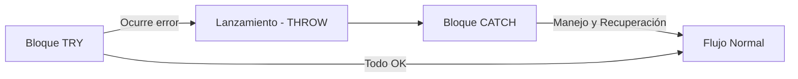
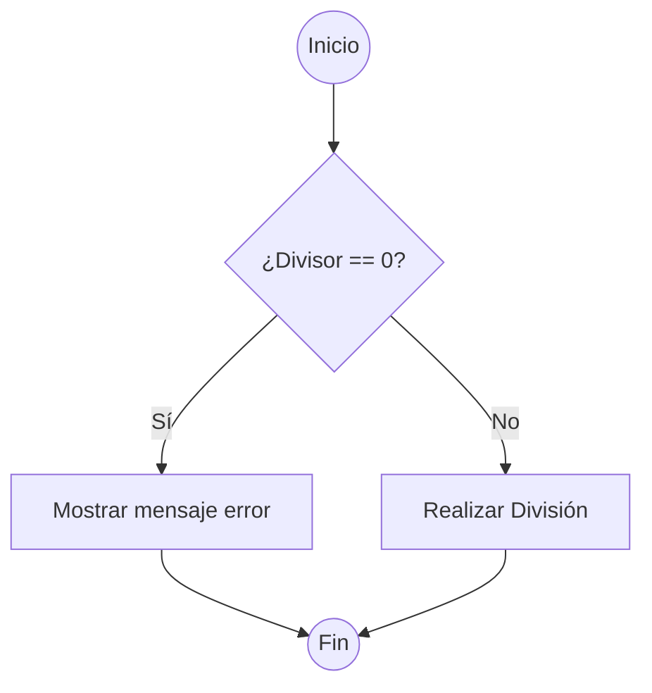
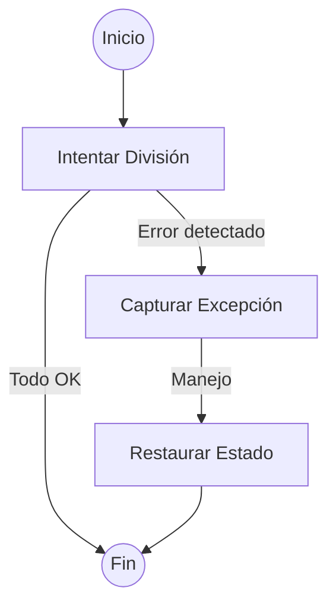
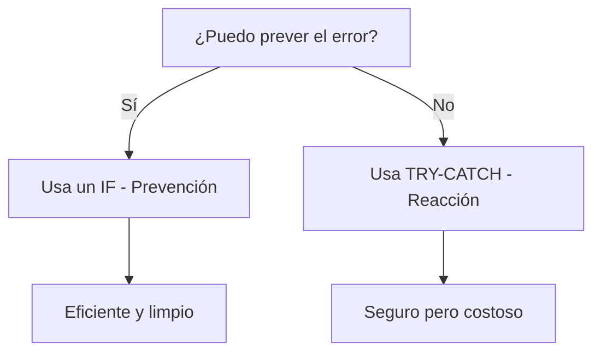
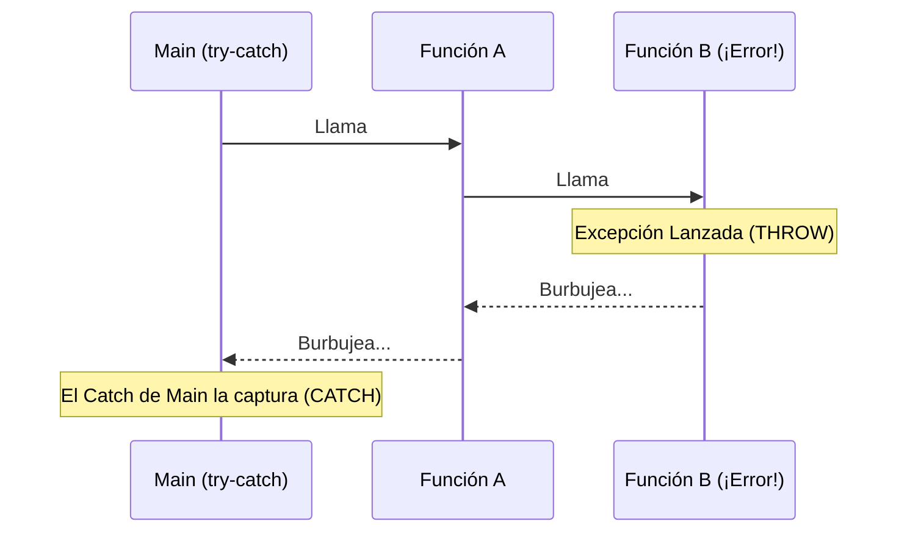

- [4. Control de Excepciones](#4-control-de-excepciones)
  - [4.1. ¿Qué es realmente una Excepción?](#41-qué-es-realmente-una-excepción)
  - [4.2. Lanzar una Excepción (`throw`)](#42-lanzar-una-excepción-throw)
    - [¿Cuándo debemos usar `throw`?](#cuándo-debemos-usar-throw)
  - [4.3. Capturar una Excepción (`try-catch`)](#43-capturar-una-excepción-try-catch)
    - [El bloque `try`: La zona vigilada](#el-bloque-try-la-zona-vigilada)
    - [El bloque `catch`: El gestor del error](#el-bloque-catch-el-gestor-del-error)
  - [4.4. El significado profundo de manejar el error](#44-el-significado-profundo-de-manejar-el-error)
  - [4.5. Prevención vs. Reacción: El caso de la División por Cero](#45-prevención-vs-reacción-el-caso-de-la-división-por-cero)
    - [Opción A: El Arquitecto Previsor (Uso de `if`)](#opción-a-el-arquitecto-previsor-uso-de-if)
    - [Opción B: El Rescate de Emergencia (Uso de `try-catch`)](#opción-b-el-rescate-de-emergencia-uso-de-try-catch)
  - [4.6. El peligro de tratar las excepciones a la ligera](#46-el-peligro-de-tratar-las-excepciones-a-la-ligera)
    - [1. El Estado Inconsistente (Pérdida de datos)](#1-el-estado-inconsistente-pérdida-de-datos)
    - [2. El "Silencio de los Inocentes" (Catch vacíos)](#2-el-silencio-de-los-inocentes-catch-vacíos)
  - [4.7. La Diferencia Fundamental: Compilación vs. Ejecución](#47-la-diferencia-fundamental-compilación-vs-ejecución)
  - [4.8. El Burbujeo de Excepciones](#48-el-burbujeo-de-excepciones)
  - [4.9. Bloques `try`, `catch` y `finally`](#49-bloques-try-catch-y-finally)
  - [4.10. Aserciones (`assert`)](#410-aserciones-assert)
  - [4.11. Buenas prácticas](#411-buenas-prácticas)


# 4. Control de Excepciones

El **control de excepciones** es una técnica de programación esencial para manejar errores que ocurren durante la ejecución de un programa de forma inesperada. En lugar de que el programa se detenga abruptamente (se "cuelgue" o "rompa"), las excepciones permiten **capturar y gestionar** estos errores de manera controlada.

## 4.1. ¿Qué es realmente una Excepción?
Una **excepción** es un evento que ocurre durante la ejecución de un programa y que interrumpe el flujo normal de las instrucciones. Es fundamental conocerlas porque evitan el colapso del programa y proporcionan información valiosa sobre el fallo.

## 4.2. Lanzar una Excepción (`throw`)
Lanzar una excepción es el acto de **notificar** que algo ha ido mal y que el flujo normal no puede continuar. Es como disparar una bengala de auxilio.

### ¿Cuándo debemos usar `throw`?
Como programadores, lanzamos excepciones cuando detectamos que los datos o el estado del programa no cumplen con las "reglas del negocio", incluso si no hay un error técnico de la máquina.
*   **Ejemplo**: Si un usuario intenta sacar 500€ y solo tiene 100€, el ordenador no "falla" (la resta es posible), pero nuestro programa debe **lanzar** una excepción de `SaldoInsuficienteException`.

```csharp
function void retirarDinero(decimal cantidad) {
    if (cantidad > saldoActual) {
        // Lanzamos la bengala: "¡Aquí ha pasado algo excepcional!"
        throw new SaldoInsuficienteException("No tienes dinero suficiente.");
    }
    saldoActual -= cantidad;
}
```

## 4.3. Capturar una Excepción (`try-catch`)
Capturar es el acto de **recibir** esa bengala de auxilio y actuar en consecuencia para que el programa no muera.

### El bloque `try`: La zona vigilada
Dentro del `try` colocamos el código que sabemos que **puede fallar**. Es una zona donde el programa está "alerta".

### El bloque `catch`: El gestor del error
El `catch` es el código que se ejecuta **solo si** algo falla en el `try`. Su misión es:
1.  **Informar** al usuario de forma amigable (no con códigos raros).
2.  **Limpiar** o deshacer cambios a medias (Rollback).
3.  **Recuperar** el programa para que siga funcionando.



## 4.4. El significado profundo de manejar el error
Manejar una excepción **NO es solo poner un mensaje**. Es devolver el programa a un **Estado Estable**. 
*   Si una transferencia bancaria falla a la mitad, el `catch` debe asegurar que el dinero vuelve a la cuenta de origen. Eso es gestionar la excepción con profesionalidad.

## 4.5. Prevención vs. Reacción: El caso de la División por Cero

Para entender por qué no debemos abusar de las excepciones, comparemos dos formas de evitar que un programa explote al dividir por cero.

### Opción A: El Arquitecto Previsor (Uso de `if`)
Es la forma más natural y eficiente. Simplemente preguntamos antes de actuar.

```csharp
Main {
    int numerador = 10;
    int divisor = 0;

    if (divisor != 0) {
        writeLine("Resultado: " + (numerador / divisor));
    } else {
        writeLine("Error: No se puede dividir por cero.");
    }
}
```
*   **¿Qué hace el ordenador?**: Una simple comparación de un nanosegundo. Si es cero, salta al `else` y el programa sigue su curso felizmente. Es limpio, rápido y seguro.



### Opción B: El Rescate de Emergencia (Uso de `try-catch`)
Aquí dejamos que el error ocurra y luego intentamos "arreglarlo".

```csharp
Main {
    int numerador = 10;
    int divisor = 0;

    try {
        writeLine("Resultado: " + (numerador / divisor));
    } catch (DivideByZeroException e) {
        writeLine("Error capturado: " + e.message);
    }
}
```
*   **¿Qué hace el ordenador?**: Cuando ocurre la división por cero, el procesador se detiene en seco. Se interrumpe el flujo, se crea un objeto `Exception` (que consume memoria), se guarda todo el estado de la pila de llamadas y se empieza a buscar frenéticamente un `catch`. **Es un proceso miles de veces más lento que un `if`.**



## 4.6. El peligro de tratar las excepciones a la ligera

No debemos ver el `try-catch` como una "curita" o un parche mágico. Manejar mal una excepción es más peligroso que no manejarla, por dos razones críticas:

### 1. El Estado Inconsistente (Pérdida de datos)
Si una excepción salta en mitad de un proceso largo (ej. actualizar 5 tablas de una base de datos) y el `catch` solo muestra un mensaje pero no deshace los cambios de las 2 primeras tablas, tus datos habrán quedado **corruptos**. Has perdido la integridad de la información.

### 2. El "Silencio de los Inocentes" (Catch vacíos)
Un error muy común es capturar una excepción y no hacer nada con ella: `catch (Exception e) { }`. 
Esto es **gravísimo**. El programa seguirá funcionando, pero con errores internos ocultos. Es como si en un avión se encendiera una luz de alarma de motor y el piloto simplemente le pusiera un trozo de cinta aislante encima para no verla. El desastre acabará ocurriendo más tarde y será mucho más difícil encontrar el origen.



## 4.7. La Diferencia Fundamental: Compilación vs. Ejecución
| Fase                      | Nivel de Control               | Ejemplos de Fallo                                                           |
| :------------------------ | :----------------------------- | :-------------------------------------------------------------------------- |
| **Tiempo de Compilación** | Alto (Programador)             | Sintaxis, tipos de datos incorrectos.                                       |
| **Tiempo de Ejecución**   | Bajo (Entorno)                 | Disco lleno, red cortada, entrada de usuario inválida.                      |

## 4.8. El Burbujeo de Excepciones
Si una función lanza una excepción y no tiene un `catch`, esta "burbujea" hacia arriba hasta encontrar uno.



## 4.9. Bloques `try`, `catch` y `finally`
1.  **`try`**: "Intenta" ejecutar esto.
2.  **`catch`**: "Si falla", haz esto otro.
3.  **`finally`**: "Hagas lo que hagas", ejecuta esto al final (limpieza de recursos).

## 4.10. Aserciones (`assert`)
Herramienta de depuración para verificar supuestos durante el desarrollo. Si falla, el programa se detiene. **Nunca debe llegar al usuario final**.

## 4.11. Buenas prácticas
*   **Captura específica**: No captures `Exception` si puedes capturar `ExcepcionFormatoInvalido`. Es como llamar a un médico general vs un especialista.
*   **No ignores errores**: Un `catch` vacío es un peligro; oculta problemas que volverán a salir más tarde.
*   **Informa bien**: Da mensajes que ayuden al usuario a corregir el problema.

