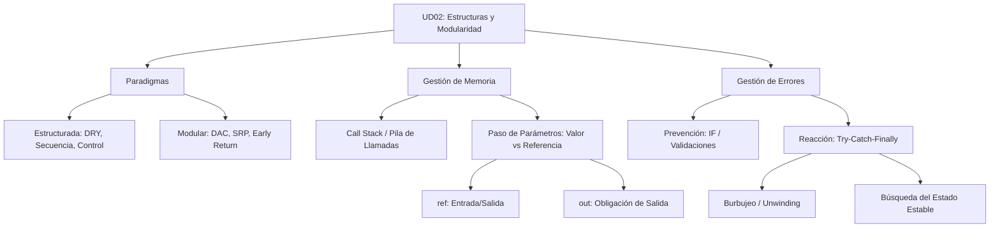

- [5. Resumen y Conclusiones UD02](#5-resumen-y-conclusiones-ud02)
  - [5.1. El Lenguaje de Programación Pseudocódigo DAW](#51-el-lenguaje-de-programación-pseudocódigo-daw)
  - [5.2. Resumen Ejecutivo de la Unidad](#52-resumen-ejecutivo-de-la-unidad)
  - [5.3. Mapa Conceptual Maestro](#53-mapa-conceptual-maestro)
  - [5.4. ⚠️ Top 5 Errores Comunes (Evítalos)](#54-️-top-5-errores-comunes-evítalos)
  - [🚩 Checklist de Supervivencia UD02](#-checklist-de-supervivencia-ud02)

# 5. Resumen y Conclusiones UD02

## 5.1. El Lenguaje de Programación Pseudocódigo DAW
Nuestra herramienta fundamental para aprender lógica pura. Recuerda que la sintaxis es un medio para un fin: resolver problemas mediante algoritmos estructurados y modulares.
[Guía Completa del Lenguaje](../lenguaje_daw.md)

## 5.2. Resumen Ejecutivo de la Unidad
En esta unidad hemos transformado nuestra forma de programar:
- **Estructuras de Control**: Hemos pasado de programas lineales a programas inteligentes que deciden (`if/switch`) y automatizan tareas repetitivas (`while/for`).
- **Programación Modular**: Hemos aplicado el principio "Divide y Vencerás", entendiendo que un buen software es una colección de piezas pequeñas (módulos) con responsabilidades únicas.
- **Seguridad y Memoria**: Hemos aprendido que cómo pasamos los datos (`ref`, `out`, `T?`) y cómo gestionamos los fallos (Excepciones) define la fiabilidad de nuestra aplicación.

## 5.3. Mapa Conceptual Maestro

## 5.4. ⚠️ Top 5 Errores Comunes (Evítalos)
1.  **El ";" asesino**: No pongas punto y coma después de un `if` o un `while`.
2.  **Bucle Infinito**: Comprueba siempre que tu variable de control cambia dentro del bucle.
3.  **Catch "Mudo"**: Nunca dejes un bloque `catch` vacío. Si el programa falla, debes saberlo.
4.  **Olvidar el `ref` en la llamada**: Si el parámetro pide `ref`, debes escribir `ref` también al llamar a la función.
5.  **Casting de entrada**: `readLine()` siempre devuelve texto. No intentes sumarle un número directamente.

## 🚩 Checklist de Supervivencia UD02

- [ ] ¿Entiendo que el `if` es para prevenir y el `try-catch` para reaccionar?
- [ ] ¿Sé por qué una excepción es "cara" en rendimiento?
- [ ] ¿Diferencio entre un `ref` (modificar algo que ya existe) y un `out` (generar un resultado nuevo)?
- [ ] ¿Soy capaz de trazar una función recursiva identificando su caso base?
- [ ] ¿Entiendo que `var` no rompe la Regla de Exactitud de Tipos?
- [ ] ¿Sé usar el `Early Return` para que mi código no parezca un "Hadouken" de flechas?
- [ ] ¿Comprendo qué ocurre en la Pila de Llamadas cuando una función hace un `return`?
