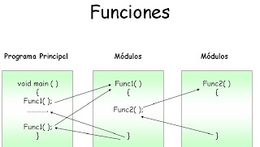
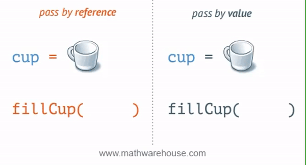
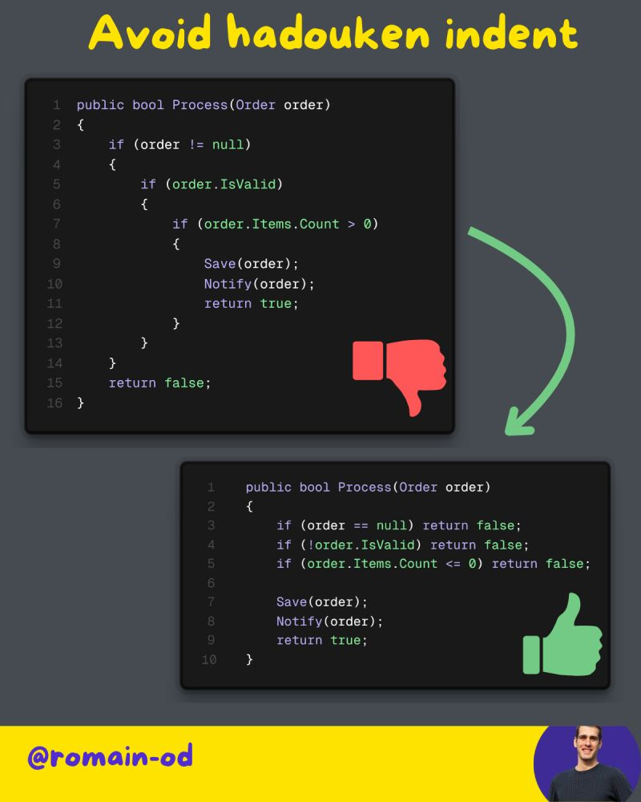
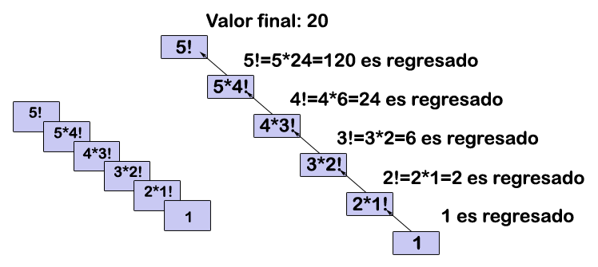
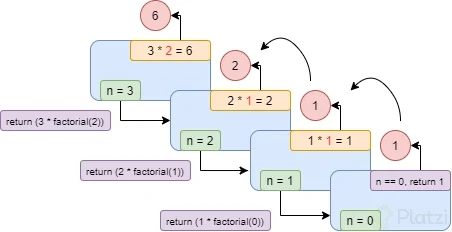

# Programación - 02 Programación Estructurada y Modular

Tema 02 Programación Estructurada y Modular. 1DAW. Curso 2025-2026.


- [Programación - 02 Programación Estructurada y Modular](#programación---02-programación-estructurada-y-modular)
- [Contenido en Youtube](#contenido-en-youtube)
  - [1. Introducción](#1-introducción)
  - [2. Programación Estructurada](#2-programación-estructurada)
    - [2.1. Secuencias](#21-secuencias)
    - [2.2. Condicionales](#22-condicionales)
    - [2.3. Bucles](#23-bucles)
    - [2.4. Mecanismos de Control de Bucles](#24-mecanismos-de-control-de-bucles)
      - [A. Bucles controlados por Indicadores (Banderas o Flags)](#a-bucles-controlados-por-indicadores-banderas-o-flags)
      - [B. Bucles controlados por Centinela](#b-bucles-controlados-por-centinela)
      - [C. Bucles Anidados](#c-bucles-anidados)
  - [3. Programación Modular](#3-programación-modular)
    - [3.1. Funciones](#31-funciones)
    - [3.2. Procedimientos](#32-procedimientos)
    - [3.3. Parámetros y Argumentos](#33-parámetros-y-argumentos)
    - [3.4. Paso por valor y paso por referencia](#34-paso-por-valor-y-paso-por-referencia)
      - [¿Cuándo y por qué usar cada uno?](#cuándo-y-por-qué-usar-cada-uno)
    - [3.5. Ámbito de las variables](#35-ámbito-de-las-variables)
    - [3.6. Parámetros por defecto, opcionales y nombrados](#36-parámetros-por-defecto-opcionales-y-nombrados)
    - [3.7. Sobrecarga de funciones y procedimientos](#37-sobrecarga-de-funciones-y-procedimientos)
    - [3.8. Parámetros variables o indeterminados](#38-parámetros-variables-o-indeterminados)
    - [3.9. Parámetros de salida](#39-parámetros-de-salida)
    - [3.10. Early Return para simplificar condicionales](#310-early-return-para-simplificar-condicionales)
      - [Ventajas del Early Return para Condicionales](#ventajas-del-early-return-para-condicionales)
      - [Ejemplo 1: Evitar anidamiento en la validación](#ejemplo-1-evitar-anidamiento-en-la-validación)
      - [Ejemplo 2: Romper una cadena de validación compleja](#ejemplo-2-romper-una-cadena-de-validación-compleja)
    - [3.11. Recursividad](#311-recursividad)
    - [3.11. Paquete o módulo](#311-paquete-o-módulo)
    - [3.12. Control de excepciones](#312-control-de-excepciones)
      - [3.12.1 La jerarquía de las excepciones](#3121-la-jerarquía-de-las-excepciones)
      - [3.12.2 Excepciones requeridas vs. no requeridas](#3122-excepciones-requeridas-vs-no-requeridas)
      - [3.12.3 Bloques `try`, `catch` y `finally`](#3123-bloques-try-catch-y-finally)
      - [3.12.4 Lanzar excepciones manualmente (`throw`)](#3124-lanzar-excepciones-manualmente-throw)
      - [3.12.5 Aserciones (`assert`)](#3125-aserciones-assert)
      - [3.12.6 Buenas prácticas para el control de excepciones](#3126-buenas-prácticas-para-el-control-de-excepciones)
- [4. El Lenguaje de Programación Pseudocódigo DAW](#4-el-lenguaje-de-programación-pseudocódigo-daw)
  - [Referencias](#referencias)
  - [Autor](#autor)
    - [Contacto](#contacto)
  - [Licencia de uso](#licencia-de-uso)


# Contenido en Youtube

- [Podcast](https://youtu.be/oO7GtR0G1AQ)
- [Resumen](https://youtu.be/EHGiJiN9kEY)
- [Uso de condicionales](https://youtu.be/3oHOkQTzMK8)
- [Bucles While o For](https://youtu.be/3QaCQsjTRW8)
- [Paso por valor y paso por referencia](https://youtu.be/e6YyiZyE2O4)
- [Manejo de Excepciones](https://youtu.be/LVKQKNZsv2o)
- [Lista de Reproducción](https://www.youtube.com/watch?v=wKCdgacEr4Q&list=PLGIH-7eZDbVw6q2AdcAUe2r6YxJYBkfCi)


## 1. Introducción
En este tema vamos a ver los conceptos básicos de la programación estructurada y modular. Estos conceptos son fundamentales para entender cómo se programan los ordenadores y cómo se pueden resolver problemas de forma eficiente y clara.

Son los primeros paradigmas de programación que debemos aprender y dominar, ya que son la base para entender otros paradigmas más avanzados como la programación orientada a objetos o la programación funcional. Con ello vamos a dotar de comportamiento imperativo, es decir, vamos a indicarle al ordenador qué hacer y cómo hacerlo, paso a paso y darle vida a nuestros algoritmos.

## 2. Programación Estructurada

La **programación estructurada** es un paradigma que busca crear programas más claros y fáciles de mantener. Se basa en el **Teorema de la programación estructurada**, que demuestra que cualquier algoritmo puede ser implementado utilizando únicamente tres estructuras de control básicas:

1.  **Secuencia**: Las instrucciones se ejecutan una después de la otra, en el orden en que están escritas.
2.  **Condicional (o Selección)**: Se ejecuta un bloque de código u otro dependiendo de si se cumple o no una condición.
3.  **Bucle (o Iteración)**: Un bloque de código se repite mientras se cumpla una determinada condición.


### 2.1. Secuencias

Es la estructura más simple. El programa ejecuta las instrucciones de arriba hacia abajo, una por una. Es la forma más básica de controlar el flujo de un programa, una instrucción tras otra.

```csharp
Main {
    // Ejemplo de Secuencia
    writeLine("Hola");
    writeLine("¿Cómo estás?");

    // Leemos el nombre del usuario
    writeLine("Por favor, introduce tu nombre:");
    string nombre = readLine();

    // Mostramos un saludo personalizado
    writeLine("Encantado de conocerte, " + nombre);
}
```

### 2.2. Condicionales

Permiten que nuestro programa tome decisiones y se comporte de manera diferente según las circunstancias.

  * **Condicional simple (`if`)**: Evalúa una condición booleana (verdadero o falso). Si la condición es verdadera, se ejecuta el bloque de código dentro del `if`. Si es falsa, se salta ese bloque y continúa con el resto del programa.
  
```csharp
Main {
    // Condicional simple
    var edad = 20;
    if (edad >= 18) {
        writeLine("Eres mayor de edad.");
    }
}
```

  * **Condicional compuesto (`if-else`)**: Permite ejecutar un bloque de código si se cumple una condición y otro bloque si no se cumple.

```csharp
Main {
    // Condicional compuesto
    var edad = 16;
    if (edad >= 18) {
        writeLine("Eres mayor de edad.");
    } else {
        writeLine("Eres menor de edad.");
    }
}
```

  * **Condicionales múltiples (`if-else if-else`)**: Permiten encadenar varias condiciones. El programa evalúa las condiciones en orden y ejecuta el bloque de la primera que sea verdadera. Si ninguna lo es, se ejecuta el bloque `else` final (si existe).


```csharp
Main {
    // Condicionales múltiples
    var edadAlumno = 16;
    if (edadAlumno >= 18) {
        writeLine("Eres mayor de edad.");
    } else if (edadAlumno >= 16) {
        writeLine("Casi eres mayor de edad.");
    } else {
        writeLine("Eres menor de edad.");
    }
}
```

  * **Estructura `switch`**: Cuando necesitamos comparar una única variable contra múltiples valores posibles, usar una cadena larga de `if-else if` puede ser engorroso y poco legible (efecto "cascada"). La estructura `switch` (o `según` en pseudocódigo) ofrece una alternativa mucho más limpia y organizada. Evalúa una expresión y ejecuta el bloque de código (`case`) que coincida con el valor. Es obligatorio incluir una sección `default` para manejar los casos en que ninguno de los valores coincide.


```csharp
Main {
    // Ejemplo de switch para los días de la semana
    var dia = 3; // Suponemos que 1 es Lunes, 2 es Martes, etc.
    string nombreDelDia;

    switch (dia) {
        case 1:
            nombreDelDia = "Lunes";
            break; // 'break' es crucial para salir del switch
        case 2:
            nombreDelDia = "Martes";
            break;
        case 3:
            nombreDelDia = "Miércoles";
            break;
        case 4:
            nombreDelDia = "Jueves";
            break;
        case 5:
            nombreDelDia = "Viernes";
            break;
        case 6:
        case 7:
            nombreDelDia = "Fin de semana";
            break; // Se pueden agrupar casos
        default:
            nombreDelDia = "Día inválido";
            break;
    }
    writeLine("Hoy es: " + nombreDelDia); // Imprimirá "Hoy es: Miércoles"
}
```

Una de las técnicas más útiles para evitar errores comunes en los condicionales es el uso de **paréntesis** para agrupar condiciones complejas. Esto mejora la legibilidad y asegura que las condiciones se evalúan en el orden correcto.

```csharp
Main {
    var edad = 20;
    var tieneDNI = true;
    // Uso de paréntesis para mayor claridad
    if ((edad >= 18) && (tieneDNI)) {
        writeLine("Puedes votar.");
    } else {
        writeLine("No puedes votar.");
    }
}
```
### 2.3. Bucles

Los bucles nos permiten repetir un bloque de código varias veces, ahorrándonos escribir la misma lógica una y otra vez.

   * **Bucles indefinidos (`while` y `do-while`)**: Se ejecutan mientras se cumpla una condición. Son útiles cuando no sabemos cuántas iteraciones se necesitarán. `while` evalúa la condición antes de cada iteración, mientras que `do-while` la evalúa después, garantizando al menos una ejecución. Esto es muy útil para menús o entradas de usuario.
```csharp
Main {
    // Ejemplo de bucle while
    var contador = 0;
    while (contador < 5) {
        writeLine("Contador: " + contador);
        contador = contador + 1; // Incrementamos el contador
    }
    // Ejemplo de bucle do-while
    var opcion;
    do {
        writeLine("Menú:");
        writeLine("1. Opción 1");
        writeLine("2. Opción 2");
        writeLine("3. Salir");
        opcion = readLine();
        writeLine("Has seleccionado la opción: " + opcion);
    } while (opcion != "3");
}
```

  * **Bucles definidos (`for`)**: Los bucles definidos se utilizan cuando sabemos de antemano cuántas veces queremos repetir un bloque de código. La estructura `for` incluye la inicialización, la condición y el incremento/decremento en una sola línea, lo que facilita su lectura y escritura. A continuación se muestran varios ejemplos para dominar su funcionamiento.

```csharp
Main {
    // 1. Bucle 'for' ascendente de 1 en 1
    writeLine("Contando hacia adelante de 1 en 1:");
    for (int i = 0; i <= 5; i = i + 1) {
        writeLine(i); // Imprime 0, 1, 2, 3, 4, 5
    }

    // 2. Bucle 'for' descendente de 1 en 1
    writeLine("Contando hacia atrás de 1 en 1:");
    for (int i = 5; i >= 0; i = i - 1) {
        writeLine(i); // Imprime 5, 4, 3, 2, 1, 0
    }

    // 3. Bucle 'for' con saltos positivos (de 2 en 2)
    writeLine("Contando hacia adelante de 2 en 2:");
    for (int i = 0; i <= 10; i = i + 2) {
        writeLine(i); // Imprime 0, 2, 4, 6, 8, 10
    }

    // 4. Bucle 'for' con saltos negativos (de 3 en 3)
    writeLine("Contando hacia atrás de 3 en 3:");
    for (int i = 15; i >= 0; i = i - 3) {
        writeLine(i); // Imprime 15, 12, 9, 6, 3, 0
    }
}
```

Su solicitud requiere que todos los fragmentos de código del apartado **2.3.4. Mecanismos de Control de Bucles** se integren dentro del bloque principal `Main { ... }`, que es el punto de entrada de ejecución del programa en el lenguaje DAW.

A continuación, se presenta la reescritura completa del apartado, encapsulando los ejemplos dentro de la estructura `Main` y utilizando la sintaxis del lenguaje DAW, incluyendo el manejo de entrada/salida (`readLine`, `writeLine`) y la conversión explícita de tipos (`int.Parse`).

### 2.4. Mecanismos de Control de Bucles

Existen **tres formas típicas** de controlar cuándo se ejecuta un bucle: bucles con contador, bucles controlados por indicadores (banderas o *flags*), y bucles controlados por centinela.

#### A. Bucles controlados por Indicadores (Banderas o Flags)

Las **banderas** (*flags*) son variables que suelen ser de tipo lógico (`bool`) y se utilizan para controlar la ejecución de un bucle. Se inicializan antes del bucle y cambian de valor dentro del mismo cuando se cumple la condición de parada.

**Ejemplo 1: Estructura básica de una bandera dentro de `Main`**

```csharp
Main {
    // Declaración de variables dentro del ámbito local de Main
    bool continuar = true; 
    
    // Mientras la bandera 'continuar' sea verdadera
    while (continuar) 
    {     
        // Simulamos instrucciones
        // ...
        
        // Si se cumple una condición (ej. leer ‘N’ del usuario), cambiamos el indicador
        if (condicionParaAcabar) 
        {         
            continuar = false;     
        }     
        // ... 
    }
}
```

**Ejemplo 2: Determinar si un número contiene solo cifras menores que cinco**

```csharp
Main {
    // Declaración de variables
    bool menor; 
    int num;
    
    writeLine("Introduce un número:"); // Salida
    num = (int)readLine(); // Entrada que requiere casting
    
    menor = true; // Inicializacion del indicador
    
    // El bucle se mantiene mientras el indicador sea true Y el número tenga cifras
    while (menor && (num > 0)) 
    {     
        // Utilizamos el operador módulo (%) para revisar la última cifra
        if (num % 10 >= 5) 
        {         
            menor = false; // Cambiamos la bandera a false
        }     
        num = num / 10; // Eliminamos la última cifra (división entera)
    } 
    
    if (menor) 
    {
        writeLine("Todas las cifras son menores que 5");
    } 
    else 
    {
        writeLine("Hay alguna cifra mayor o igual que 5");
    }
}
```

#### B. Bucles controlados por Centinela

Los bucles controlados por centinela utilizan un **valor especial** (el centinela) que indica la parada de la iteración.

**Ejemplo: Sumar números hasta que se introduce 0 (centinela)**

```csharp
Main {
    // Declaración de variables
    int suma = 0; 
    int num;

    writeLine("Introduce números a sumar, 0 para acabar"); // Salida
    num = (int)readLine(); // Entrada que requiere casting

    // El bucle while continúa mientras el número introducido no sea el centinela (0)
    while (num != 0) 
    {     
        suma = suma + num; // Acumulación
        
        writeLine("Introduce números a sumar, 0 para acabar"); 
        num = (int)readLine(); // Nueva entrada
    } 

    writeLine(suma); // Salida del resultado final
}
```

#### C. Bucles Anidados

Los bucles se pueden **anidar** (un bucle dentro de otro). Esta técnica es especialmente útil para el manejo de matrices.

**Ejemplo: Generar una tabla de multiplicar (1 a 10) usando bucles `for` anidados**

```csharp
Main {
    // Declaración de variables de control del bucle (i, j)
    int i, j; 

    // Bucle externo
    for (i = 1; i <= 10; i++) 
    {     
        // Bucle interno
        for (j = 1; j <= 10; j++) 
        {         
            // Usamos concatenación (+) para mostrar el resultado
            writeLine(i + "*" + j + "=" + (i * j)); 
        } 
    }
}
```

## 3. Programación Modular

La **programación modular** es un paradigma que consiste en dividir un programa grande y complejo en partes más pequeñas, manejables e independientes, llamadas **módulos**. Cada módulo se encarga de una tarea específica. En el lenguaje DAW, estos módulos se implementan como **funciones** y **procedimientos**.

Las ventajas que ofrece la programación modular son:
- Facilita la resolución del problema.
- Aumenta la claridad y legibilidad de todo el programa.
- Permite que varios programadores trabajen en el mismo proyecto.
- Reduce el tiempo de desarrollo ya que se pueden reutilizar esos módulos en varios programas.
- Aumenta la fiabilidad porque es más sencillo diseñar y depurar módulos y el mantenimiento en mas fácil.

La descomposición modular se basa en la técnica “Divide y Vencerás” (DAC o Divide And Conquer), esta técnica tiene dos pasos:
- Identificación de los subproblemas y construcción de los módulos que lo resuelven.
- Combinación de los módulos para resolver el problema original.



### 3.1. Funciones
Una **función** es un bloque de código que realiza una tarea específica y devuelve un valor. Las funciones pueden recibir datos de entrada (argumentos) y siempre devuelven un resultado mediante la sentencia `return`.

```csharp
function int sumar(int a, int b) {
    // Esta función toma dos enteros como argumentos y devuelve su suma.
    return a + b; // Devuelve la suma de a y b
}

Main {
    // Llamamos a la función sumar y almacenamos el resultado en la variable resultado
    int resultado = sumar(5, 3);
    writeLine("La suma es: " + resultado); // Imprime "La suma es: 8"
}
```

### 3.2. Procedimientos
Un **procedimiento** es similar a una función, pero no devuelve ningún valor. Se utiliza para ejecutar una serie de instrucciones que realizan una tarea específica. Los procedimientos pueden recibir datos de entrada (argumentos) pero no tienen una sentencia `return`.

```csharp
procedure saludar(string nombre) {
    // Este procedimiento toma un nombre como argumento y muestra un saludo personalizado.
    writeLine("Hola, " + nombre + "! Bienvenido al programa.");
}
Main {
    // Llamamos al procedimiento saludar con el nombre "Ana"
    saludar("Ana"); // Imprime "Hola, Ana! Bienvenido al programa."
}
```

### 3.3. Parámetros y Argumentos
Los **parámetros** son las variables que se definen en la declaración de una función o procedimiento. Actúan como "marcadores de posición" para los valores que se pasarán cuando se llame a la función o procedimiento.
Los **argumentos** son los valores reales que se pasan a la función o procedimiento cuando se llama. Estos valores se asignan a los parámetros correspondientes.

```csharp
function int multiplicar(int x, int y) {
    // x e y son los parámetros de la función
    return x * y; // Devuelve el producto de x e y
}
Main {
    // 4 y 5 son los argumentos que se pasan a la función
    int resultado = multiplicar(4, 5);
    writeLine("El producto es: " + resultado); // Imprime "El producto es: 20"
}
```


### 3.4. Paso por valor y paso por referencia

Esta es una de las distinciones más importantes sobre cómo se pasan los argumentos a los módulos:

  * **Paso por valor (por defecto)**: Cuando pasas un argumento por valor, la función recibe una **copia** del dato original. Cualquier modificación que hagas al parámetro dentro de la función **no afectará a la variable original** fuera de ella. Este es el comportamiento por defecto en la mayoría de los lenguajes de programación, incluido DAW.
  
  ```csharp
    function int incrementar(int numero) {
        // Esta función recibe una copia del valor original.
        numero = numero + 1; // Incrementa la copia, no el original.
        return numero; // Devuelve el valor incrementado.
    }

    Main {
        var valorOriginal = 10;
        writeLine("Valor original antes de la función: " + valorOriginal); // Imprime 10
        var nuevoValor = incrementar(valorOriginal);
        writeLine("Valor devuelto por la función: " + nuevoValor); // Imprime 11
        writeLine("Valor original después de la función: " + valorOriginal); // Sigue imprimiendo 10
    }
  ```

  * **Paso por referencia (usando `ref`)**: Cuando pasas un argumento por referencia, en lugar de una copia, la función recibe la **dirección de memoria** de la variable original. Esto significa que cualquier cambio que hagas al parámetro dentro de la función **modificará directamente la variable original**. En el lenguaje DAW, indicamos esto con la palabra clave `ref`.

```csharp
procedure duplicar(ref int numero) {
    // Esta función recibe una referencia al valor original.
    numero = numero * 2; // Modifica directamente el valor original.
}

Main {
    var valorOriginal = 10;
    writeLine("Valor original antes de la función: " + valorOriginal); // Imprime 10
    duplicar(ref valorOriginal); // Pasamos la variable por referencia
    writeLine("Valor original después de la función: " + valorOriginal); // Ahora imprime 20
}
```



#### ¿Cuándo y por qué usar cada uno?

La elección entre paso por valor y por referencia es una decisión de diseño importante con implicaciones en la seguridad, claridad y eficiencia del código.

  * **Usa el paso por VALOR (la opción por defecto) cuando...**

      * **Quieres seguridad y predictibilidad**: Es la forma más segura de trabajar. Garantiza que una función no pueda modificar tus variables originales de forma inesperada. Esto se llama "inmunidad a efectos secundarios" y hace que tu programa sea mucho más fácil de depurar.
      * **La función es una "calculadora"**: Si la función simplemente toma unas entradas, calcula un resultado y lo devuelve, el paso por valor es ideal. Piensa en una función `sumar(a, b)`: no quieres que los valores originales de `a` y `b` cambien, solo quieres obtener su suma.
      * **Trabajas con datos simples**: Para tipos de datos simples (`int`, `bool`, etc.), el coste de hacer una copia es insignificante.

  * **Usa el paso por REFERENCIA (con `ref`) cuando...**

      * **Necesitas "devolver" múltiples valores**: Una función solo puede tener una sentencia `return`. Si necesitas que un módulo modifique varias de tus variables, pasarlas por referencia es una forma de lograrlo. El módulo no "devuelve" los valores, sino que los altera directamente en su ubicación original.
      * **La función tiene el propósito explícito de modificar el dato**: A veces, el objetivo de un procedimiento es precisamente cambiar el estado de una variable. Por ejemplo, un procedimiento `reiniciarContador(ref int contador)` tiene la clara intención de poner a `0` la variable que le pases. Usar `ref` hace esta intención explícita y clara.
      * **Buscas eficiencia con datos muy grandes (en otros lenguajes)**: En lenguajes de más bajo nivel, copiar estructuras de datos muy grandes (arrays con millones de elementos, objetos complejos, lo veremos en el siguiente tema) puede ser lento y consumir mucha memoria. Pasar una referencia (que es solo una dirección de memoria) es mucho más rápido. Aunque en DAW no nos preocupamos tanto por esto, es un concepto fundamental en programación.

<!-- end list -->

```csharp
procedure intercambiarValores(ref int x, ref int y) {
    // Este procedimiento necesita modificar las variables originales,
    // por lo que el paso por referencia es obligatorio.
    writeLine("Dentro de la función (antes): x=" + x + ", y=" + y);
    var temporal = x;
    x = y;
    y = temporal;
    writeLine("Dentro de la función (después): x=" + x + ", y=" + y);
}

Main {
    var num1 = 10;
    var num2 = 20;
    writeLine("Fuera de la función (antes): num1=" + num1 + ", num2=" + num2);
    intercambiarValores(ref num1, ref num2);
    writeLine("Fuera de la función (después): num1=" + num1 + ", num2=" + num2);
}
```

### 3.5. Ámbito de las variables
El **ámbito** (o alcance) de una variable determina dónde puede ser accedida o modificada dentro del código. En DAW, las variables pueden tener dos tipos principales de ámbito:

  * **Ámbito global**: Las variables declaradas fuera de cualquier función o procedimiento tienen ámbito global. Esto significa que pueden ser accedidas y modificadas desde cualquier parte del programa, incluyendo dentro de funciones y procedimientos. Sin embargo, abusar de las variables globales puede llevar a código difícil de mantener y depurar, ya que cualquier parte del programa puede cambiar su valor. **Usa las variables globales con moderación y solo cuando sea absolutamente necesario, aunque es mejor no hacerlo**.

  * **Ámbito local**: Las variables declaradas dentro de una función o procedimiento tienen ámbito local. Solo pueden ser accedidas y modificadas dentro de ese bloque específico. Esto ayuda a evitar conflictos de nombres y hace que el código sea más modular y fácil de entender.

```csharp
var contadorGlobal = 0; // Variable global, OJO que puedes suspender por usarlas, porque siempre se puede usar paso por referencia si lo necesitas
function void incrementarContador() {
    var contadorLocal = 0; // Variable local
    contadorLocal = contadorLocal + 1; // Incrementa la variable local
    contadorGlobal = contadorGlobal + 1; // Incrementa la variable global
    writeLine("Contador local: " + contadorLocal); // Siempre imprimirá 1
    writeLine("Contador global: " + contadorGlobal); // Incrementa cada vez que se llama a la función
}
Main {
    incrementarContador(); // Llama a la función
    incrementarContador(); // Llama a la función de nuevo
    incrementarContador(); // Llama a la función de nuevo
}
```

Es importante entender que puedes tener variables que se llamen igual en diferentes ámbitos (una en Main y otra local, ya sea función/procedimiento y bucle, o if), pero son variables completamente distintas. La variable local "oculta" a la global dentro de su ámbito.

```csharp
var valor = 100; // Variable global
function void mostrarValor() {
    var valor = 50; // Variable local, oculta a la global
    writeLine("Valor dentro de la función: " + valor); // Imprime 50
}
Main {
    var valor = 75; // Variable local en Main, oculta a la global
    writeLine("Valor en Main: " + valor); // Imprime 75
    mostrarValor(); // Llama a la función que imprime 50
    writeLine("Valor global: " + valor); // Imprime 75, la variable global sigue siendo 100 
    writeLine("Valor global accedido directamente: " + 100); 
    
    if (valor > 50) {
        var valor = 25; // Variable local en el if, oculta a la de Main
        // Para evitar estas cosas nombra bien tus variables y no repitas nombres
        writeLine("Valor dentro del if: " + valor); // Imprime 25
    }
    writeLine("Valor en Main después del if: " + valor); // Imprime

}
```
### 3.6. Parámetros por defecto, opcionales y nombrados

  * **Parámetros por defecto**: Puedes definir valores por defecto para los parámetros en la declaración de una función o procedimiento. Si al llamar a la función no se proporciona un valor para ese parámetro, se usará el valor por defecto.

  * **Parámetros opcionales**: Los parámetros con valores por defecto son opcionales al llamar a la función. Puedes omitirlos y la función usará el valor por defecto.

  * **Parámetros nombrados**: Al llamar a una función, puedes especificar los nombres de los parámetros para mayor claridad y flexibilidad. Esto permite pasar argumentos en un orden diferente al definido en la función.

```csharp
function void mostrarInfo(string nombre, int edad = 18, string ciudad = "Desconocida") {
    // Muestra la información del usuario
    writeLine("Nombre: " + nombre);
    writeLine("Edad: " + edad);
    writeLine("Ciudad: " + ciudad);
}
Main {
    // Llamada con todos los parámetros
    mostrarInfo("Ana", 25, "Madrid");
    // Llamada omitiendo el parámetro opcional 'ciudad'
    mostrarInfo("Luis", 30);
    // Llamada omitiendo ambos parámetros opcionales
    mostrarInfo("Marta");
    // Llamada usando parámetros nombrados en orden diferente
    mostrarInfo(ciudad: "Barcelona", nombre: "Juan", edad: 22);
}
```

### 3.7. Sobrecarga de funciones y procedimientos
La **sobrecarga** permite definir múltiples funciones o procedimientos con el mismo nombre, pero con diferentes listas de parámetros (diferente número o tipos de parámetros). El compilador determina cuál función llamar en función de los argumentos proporcionados.

```csharp
function int calcularArea(int lado) {
    // Calcula el área de un cuadrado
    return lado * lado;
}

function decimal calcularArea(decimal radio) {
    // Calcula el área de un círculo
    return 3.1416 * radio * radio;
}

Main {
    int areaCuadrado = calcularArea(5); // Llama a la función para cuadrado
    decimal areaCirculo = calcularArea(3.5); // Llama a la función para círculo
    writeLine("Área del cuadrado: " + areaCuadrado); // Imprime 25
    writeLine("Área del círculo: " + areaCirculo); // Imprime aproximadamente 38.4846
}
```

En cualquier caso, la sobrecarga debe usarse con moderación para evitar confusiones. Asegúrate de que las funciones sobrecargadas tengan una lógica clara y distinta para que su uso sea intuitivo. Si no siempre podrás usar nombres diferentes para cada función o procedimiento o usar parámetros opcionales o por defecto y nombrados para evitar tanto su uso.


### 3.8. Parámetros variables o indeterminados
Los parámetros variables o indeterminados son parámetros que pueden tener un número indeterminado de valores. Esto nos permite tener funciones o procedimientos con un número indeterminado de parámetros. Usaremos `params` para indicar que el parámetro es variable. Siempre se recomienda poner el último en la lista de parámetros de una función. 

```csharp
function int sumarTodos(params int numeros) {
    // Suma todos los números pasados como argumentos
    int suma = 0;
    for each (var num in numeros) {
        suma = suma + num;
    }
    return suma;
}

Main {
    // Llamada con diferentes números de argumentos
    writeLine("Suma 1: " + sumarTodos(1, 2, 3)); // Imprime 6
    writeLine("Suma 2: " + sumarTodos(10, 20, 30, 40, 50)); // Imprime 150
    writeLine("Suma 3: " + sumarTodos()); // Imprime 0
}


```

### 3.9. Parámetros de salida
Permiten que una función o procedimiento devuelva múltiples valores. Se declaran con la palabra clave `out` y deben ser asignados dentro de la función antes de que esta termine. Al llamar a la función, no es necesario inicializar las variables que se pasan como parámetros de salida.
No es una práctica muy común, pero es útil en ciertos casos donde necesitas devolver varios valores sin usar estructuras o clases y no se recomienda salvo que sea estrictamente necesario.

¿Que diferencia hay en usar `out` o `ref`? Que con `ref` la variable debe estar inicializada antes de pasarla a la función, mientras que con `out` no es necesario inicializarla, pero dentro de la función debe ser asignada antes de salir de ella.

```csharp
function void obtenerDatos(out string nombre, out int edad) {
    // Asignamos valores a los parámetros de salida
    nombre = "Ana";
    edad = 25;
}

Main {
    string nombre;
    int edad;
    obtenerDatos(out nombre, out edad);
    writeLine("Nombre: " + nombre);
    writeLine("Edad: " + edad);
}
```

Aquí la diferencia con `ref` es que no es necesario inicializar `nombre` y `edad` antes de pasarlas a la función, pero dentro de la función deben ser asignadas antes de que esta termine.

```csharp
function void obtenerDatos(ref string nombre, ref int edad) {
    // Asignamos valores a los parámetros de referencia
    nombre = "Ana";
    edad = 25;
}

Main {
    string nombre = ""; // Debe estar inicializada
    int edad = 0; // Debe estar inicializada
    obtenerDatos(ref nombre, ref edad);
    writeLine("Nombre: " + nombre);
    writeLine("Edad: " + edad);
}
```

### 3.10. Early Return para simplificar condicionales

Este apartado, aunque conceptualmente es una técnica de diseño que se aplica dentro de la Programación Modular (ya que el `return` se utiliza para la salida de funciones), su objetivo es simplificar drásticamente las estructuras de control condicionales (`if-else` anidadas).

Aquí teniendo funciones y procedimientos ya definidos, podemos usar `return` para salir anticipadamente de una función cuando se cumple una condición específica, evitando así anidar múltiples niveles de `if-else`.

El Teorema Fundamental de la Programación Estructurada establece que todo programa debe tener un **único punto de entrada y un único punto de salida**. Si bien el uso del `return` fuera del final de una función (salida anticipada) técnicamente podría considerarse una desviación de este ideal teórico para fines de flujo de control, en la práctica moderna es aceptado para mejorar la legibilidad y evitar la complejidad del "efecto cascada" en las estructuras `if-else`.

La técnica de **Salida Anticipada** (*Early Return*) consiste en utilizar la sentencia `return` para terminar inmediatamente la ejecución de una **función** o **procedimiento** tan pronto como se haya cumplido una condición que hace innecesaria la ejecución del código restante.

#### Ventajas del Early Return para Condicionales

Esta técnica es especialmente útil para:

1.  **Validación de Entradas (Guard Clauses):** Permite verificar condiciones fallidas o datos inválidos al comienzo de una función y salir de inmediato.
2.  **Aplanar Estructuras Anidadas:** Evita la necesidad de anidar estructuras `if-else if-else` complejas, haciendo el código más claro y reduciendo los niveles de indentación, evitar el efecto cascada o "Hadouken".

Dado que la sentencia `return` solo es válida dentro de funciones, los ejemplos deben implementarse dentro de funciones llamadas desde `Main`.

#### Ejemplo 1: Evitar anidamiento en la validación

Supongamos que necesitamos calcular algo solo si dos números son positivos.

**Sin Salida Anticipada (Anidamiento complejo):**

```csharp
Main {
    writeLine("Ejemplo 1A: Sin Early Return");
    
    // Llamada a la función con anidamiento
    int resultado = calcularSiPositivos(5, 3);
    writeLine("Resultado: " + resultado);
    
    resultado = calcularSiPositivos(-5, 3);
    writeLine("Resultado: " + resultado);
}

// Función que calcula la suma solo si ambos son positivos (mucho anidamiento)
int calcularSiPositivos(int a, int b) {
    if (a > 0) 
    {
        if (b > 0) 
        {
            // Lógica principal
            return a + b;
        } 
        else 
        {
            writeLine("Error: El segundo número no es positivo.");
            return 0;
        }
    } 
    else 
    {
        writeLine("Error: El primer número no es positivo.");
        return 0;
    }
}
```

**Con Salida Anticipada (Lógica aplanada):**

```csharp
Main {
    writeLine("Ejemplo 1B: Con Early Return");
    
    // Llamada a la función con salida anticipada
    int resultado = calcularConEarlyReturn(5, 3);
    writeLine("Resultado: " + resultado);
    
    resultado = calcularConEarlyReturn(-5, 3);
    writeLine("Resultado: " + resultado);
}

// Función que valida y usa early return
int calcularConEarlyReturn(int a, int b) {
    // 1. Validación del primer error (Salida anticipada)
    if (a <= 0) 
    {
        writeLine("Error: El primer número no es positivo.");
        return 0; // Se sale de la función inmediatamente
    }
    
    // 2. Validación del segundo error (Salida anticipada)
    if (b <= 0) 
    {
        writeLine("Error: El segundo número no es positivo.");
        return 0; // Se sale de la función inmediatamente
    }
    
    // Lógica principal: Solo se ejecuta si NINGUNA de las condiciones anteriores se cumplió
    writeLine("Validación exitosa. Calculando...");
    return a + b;
}
```

#### Ejemplo 2: Romper una cadena de validación compleja

La salida anticipada permite gestionar los errores más comunes o condiciones triviales al principio de la función.

```csharp
Main {
    writeLine("Ejemplo 2: Validar un PIN");
    
    // Declaración de variables dentro de Main
    int pin = 1234;
    bool esValido = validarPinEarlyReturn(pin);
    writeLine("PIN 1234 es válido: " + esValido);

    pin = 55;
    esValido = validarPinEarlyReturn(pin);
    writeLine("PIN 55 es válido: " + esValido);
}

// Procedimiento de validación que devuelve un booleano (true/false)
bool validarPinEarlyReturn(int pin) {
    // 1. Salida Anticipada: El PIN debe ser positivo
    if (pin <= 0) 
    {
        writeLine("PIN no puede ser negativo o cero.");
        return false;
    }
    
    // 2. Salida Anticipada: El PIN debe tener 4 cifras (simulación)
    if (pin < 1000 || pin > 9999) 
    {
        writeLine("El PIN debe ser de 4 cifras.");
        return false;
    }
    
    // 3. Lógica principal: Si llegamos aquí, el PIN cumple todas las reglas de formato, no ha salido antes
    writeLine("PIN con formato correcto.");
    return true; 
}

// Ahora mira mos cómo sería sin Early Return
bool validarPinSinEarlyReturn(int pin) {
    if (pin <= 0) {
        // 1. Validación del primer error
        writeLine("PIN no puede ser negativo o cero.");
        return false;
    } else {
            // 2. Validación del segundo error
        if (pin < 1000 || pin > 9999) {
            writeLine("El PIN debe ser de 4 cifras.");
            return false;
        } else {
            // 3. Lógica principal
            writeLine("PIN con formato correcto.");
            return true;
        }
    }
}
```

Recuerda que el uso de `return` para salir anticipadamente solo es válido dentro de funciones y procedimientos, no en bloques de código como `if`, `for`, o `while`. Por lo tanto, esta técnica se aplica exclusivamente en el contexto de funciones y procedimientos.





### 3.11. Recursividad
La recursividad es una técnica que consiste en llamar a una función o procedimiento dentro de sí mismo. La función o procedimiento se llama a sí misma hasta que se cumple una condición que hace que la función o procedimiento deje de llamarse a sí misma (condición de parada o salida). Es importante siempre mostrar la condición de parada.



Muchos problemas son mucho más sencillos de resolver con recursividad que con iteración. Por ejemplo, el cálculo de un factorial es mucho más sencillo de resolver con recursividad que con iteración.

```csharp
function int factorial(int n) {
    // Condición de parada
    if (n <= 1) {
        return 1;
    } else {
        // Llamada recursiva
        return n * factorial(n - 1);
    }
}
Main {
    int numero = 5;
    int resultado = factorial(numero);
    writeLine("El factorial de " + numero + " es " + resultado); // Imprime 120
}
```



### 3.11. Paquete o módulo

Un **paquete** o **módulo** (también conocido como librería) es un archivo o conjunto de archivos que agrupa funciones, procedimientos y tipos de datos relacionados. Sirven para organizar el código por funcionalidades y poder reutilizarlo fácilmente en distintos proyectos. Hay muchas librerías estándar que vienen con el lenguaje DAW, y también puedes crear tus propias librerías para compartir código entre diferentes programas, una de ellas es `Math` que contiene funciones matemáticas comunes como `sqrt` (raíz cuadrada) y `random` (número aleatorio) entre otras: sin(), cos(), tan(), pow(), log(), etc.

Para usar las funcionalidades de un módulo en nuestro programa, primero debemos importarlo. En el lenguaje DAW, usaremos la palabra clave `using`.

```csharp
// Imaginemos que existe un módulo llamado "Math".
// Lo importamos al principio de nuestro programa con 'using'.
using Math;

Main {
    // --- Ejemplo con la función sqrt ---
    decimal numero = 16.0;
    // Usamos la función sqrt del módulo Math
    decimal raiz = Math.sqrt(numero);
    writeLine("La raíz cuadrada de " + numero + " es " + raiz);

    // --- Ejemplo con la función random ---
    // Generamos un número entero aleatorio entre 1 y 6 (ambos inclusive)
    int numeroAleatorio = Math.random(1, 6);
    writeLine("Lanzamiento de un dado: " + numeroAleatorio);
}
```

### 3.12. Control de excepciones

El **control de excepciones** es una técnica de programación esencial para manejar errores que ocurren durante la ejecución de un programa de forma inesperada. En lugar de que el programa se detenga abruptamente, las excepciones permiten capturar y gestionar estos errores de manera controlada. Esto es crucial para la robustez y seguridad de las aplicaciones.

#### 3.12.1 La jerarquía de las excepciones

En la mayoría de los lenguajes, incluida nuestra versión de DAW, todas las excepciones se basan en una clase principal: la clase **`Exception`**. Esta es la base de la jerarquía de excepciones y todas las excepciones que creamos o utilizamos, como `DivideByZeroException`, heredan de ella. Esto significa que un bloque `catch` que capture `Exception` puede manejar cualquier tipo de excepción.

#### 3.12.2 Excepciones requeridas vs. no requeridas

En el mundo de la programación, las excepciones se dividen en dos categorías principales:

1.  **Excepciones requeridas (o `checked exceptions`)**: Son errores que el compilador te obliga a manejar. Se utilizan para condiciones previsibles y recuperables, como un archivo que no se encuentra o un problema de red. Si no las manejas, el código no compilará. Esto fomenta la creación de código robusto, pero puede llevar a una gran cantidad de bloques `try-catch`, lo que a veces dificulta la lectura del código.
2.  **Excepciones no requeridas (o `unchecked exceptions`)**: Son errores de los que el compilador no te obliga a ocuparte. Se utilizan para errores de programación (como dividir por cero) o fallos inesperados del sistema. La idea es que son errores que el programa no puede recuperar y que deben ser corregidos por el desarrollador.

En nuestro lenguaje DAW, las excepciones son **no requeridas**.

  * **Ventajas**: El código es más limpio, ya que no tienes que escribir bloques `try-catch` para cada posible error. Se puede centrar en la lógica del negocio y manejar las excepciones solo donde es necesario.
  * **Inconvenientes**: La responsabilidad de manejar las excepciones recae por completo en el desarrollador. Si no se manejan adecuadamente, el programa puede terminar abruptamente.

#### 3.12.3 Bloques `try`, `catch` y `finally`

Para manejar excepciones, se usan los siguientes bloques de código:

1.  **`try`**: Contiene las sentencias que podrían generar una excepción. El programa "intenta" ejecutar este código.
2.  **`catch`**: Si una excepción ocurre en el bloque `try`, el control salta a este bloque para "capturar" y gestionar el error.
3.  **`finally`**: Un bloque opcional que se ejecuta **siempre**, tanto si se produce una excepción como si no. Es ideal para tareas de limpieza (cerrar archivos, conexiones). Es opcional.

#### 3.12.4 Lanzar excepciones manualmente (`throw`)

La palabra clave `throw` te permite lanzar una excepción de forma explícita. Esto es útil para errores de lógica de negocio que tú mismo quieres definir, por ejemplo, que el divisor sea cero.

**Ejemplo 1: Función que lanza una excepción si el divisor es cero.**

```csharp
function decimal dividirConThrow(int numerador, int divisor) {
    if (divisor == 0) {
        // Lanzamos una excepción de tipo DivideByZeroException
        throw new DivideByZeroException("No se puede dividir por cero.");
    }
    return (decimal)numerador / divisor;
}
```

#### 3.12.5 Aserciones (`assert`)

Las **aserciones** son una herramienta de depuración que verifica que una condición sea verdadera. Si la condición es falsa, se lanza una excepción de tipo **`AssertionException`**. Se usan para verificar supuestos sobre el estado del programa durante el desarrollo. No es recomendable dejar aserciones en el código de producción, ya que están destinadas a detectar errores lógicos durante la fase de desarrollo y prueba.

**Sintaxis en DAW:**
`assert(condición, "mensaje de error opcional");`

**Ejemplo 2: Función que usa una aserción para verificar el divisor.**

```csharp
function decimal dividirConAssert(int numerador, int divisor) {
    // La aserción verifica que el divisor no sea cero.
    // Si la condición es falsa, se lanza una 'AssertionException'.
    assert(divisor != 0, "El divisor no puede ser cero.");
    
    return (decimal)numerador / divisor;
}
```


Ambas funciones pueden ser llamadas desde el bloque `Main` y sus excepciones pueden ser capturadas en los bloques `try-catch`.

```csharp
Main {
    var num = 10;
    var div = 0;

    // Consumimos la función con `throw`
    try {
        writeLine("Intentando dividir con 'throw'...");
        var resultadoThrow = dividirConThrow(num, div);
        writeLine("Resultado: " + resultadoThrow);
    } catch (DivideByZeroException e) { // <-- Se captura un tipo de excepción específico
        writeLine("¡Catch! Error capturado: " + e.message);
    } finally {
        writeLine("Fin del ejemplo 'throw'.");
    }

    writeLine("---");

    // Consumimos la función con `assert`
    try {
        writeLine("Intentando dividir con 'assert'...");
        var resultadoAssert = dividirConAssert(num, div);
        writeLine("Resultado: " + resultadoAssert);
    } catch (AssertionException e) { // <-- Se captura un tipo de excepción específico
        writeLine("¡Catch! Error de aserción capturado: " + e.message);
    } finally {
        writeLine("Fin del ejemplo 'assert'.");
    }
}
```

El uso de **excepciones** y **aserciones** mejora la fiabilidad del programa, haciendo que la detección y corrección de errores sea más sencilla, lo cual es vital para los procesos de **depuración y prueba**.

#### 3.12.6 Buenas prácticas para el control de excepciones
1.  **Captura solo las excepciones que puedes manejar**: No uses bloques `catch` genéricos que capturen todas las excepciones a menos que tengas una razón específica para hacerlo. Captura solo las excepciones que sabes cómo manejar.
2.  **Usa `finally` para limpieza**: Si tienes recursos que deben ser liberados (como archivos o conexiones de red), usa el bloque `finally` para asegurarte de que siempre se liberen, independientemente de si ocurrió una excepción o no.
3.  **No abuses de las excepciones**: Las excepciones deben usarse para manejar errores excepcionales, no para el flujo normal del programa. No uses excepciones para controlar la lógica del programa.
4.  **Proporciona información útil en las excepciones**: Al lanzar excepciones, proporciona mensajes de error claros y útiles que ayuden a identificar la causa del problema. Esto facilitará la depuración y el mantenimiento del código.

**IMPORTANTE** Imaginamos que vas a dividir dos números, pero el divisor puede ser cero. En lugar de dejar que el programa falle, puedes manejar la excepción y mostrar un mensaje amigable al usuario. ¿Por qué es malo que el programa falle sin control o simplemente dejar que falle? Porque el usuario no sabrá qué ha pasado y el programa se cerrará abruptamente, perdiendo cualquier dato no guardado. Y aunque gestiones las excepciones, si no lo haces bien, puedes ocultar errores importantes que deberían ser corregidos, al final tu programa está fallando y puede que al levantarlo en la clausula catch no sepas qué ha pasado realmente o simplemente ignores el error y no haces nada, lo cual es peor o no lo hagas correctamente.

```csharp
Main {
    var num = 10;
    var div = 0;

    // aquí usamos throw para lanzar una excepción si el divisor es cero
    // Es la mejor manera de hacerlo? 
    try {
        var resultado = dividirConThrow(num, div);
        writeLine("Resultado: " + resultado);
    } catch (DivideByZeroException e) {
        writeLine("Error: " + e.message);
        // Aquí podrías manejar el error, por ejemplo, pedir otro divisor
    } finally {
        writeLine("Fin del intento de división.");
    }

    // aquí el if es la manera recomendada de hacerlo
    // Para qe dejar que el programe falle y se reobre si se puede evitar?
    if (div != 0) {
        var resultado = (decimal)num / div;
        writeLine("Resultado: " + resultado);
    } else {
        writeLine("No se puede dividir por cero.");
        // Aquí podrías manejar el error, por ejemplo, pedir otro divisor
    }


}
```

# 4. El Lenguaje de Programación Pseudocódigo DAW
El pseudocódigo DAW es un lenguaje de programación diseñado para ser sencillo y fácil de entender, ideal para principiantes en programación. Combina elementos de varios lenguajes de programación populares, como C#, Java y Python, para ofrecer una sintaxis clara y concisa.

Se usará para aprender los conceptos fundamentales de la programación estructurada y modular antes de pasar a lenguajes más complejos y con ello facilitar la transición a lenguajes de programación reales. Con él se pueden crear programas estructurados y modulares y resolver problemas de programación comunes.

[Lenguaje de pseudocódigo DAW](/lenguaje_daw.md)


## Referencias

  * [https://es.wikipedia.org/wiki/Tipo\_de\_dato](https://es.wikipedia.org/wiki/Tipo_de_dato)
  * [https://es.wikipedia.org/wiki/Programaci%C3%B3n\_estructurada](https://es.wikipedia.org/wiki/Programaci%C3%B3n_estructurada)
  * [https://es.wikipedia.org/wiki/Programaci%C3%B3n\_modular](https://es.wikipedia.org/wiki/Programaci%C3%B3n_modular)
  * [https://es.stackoverflow.com/questions/1493/cu%C3%A1l-es-la-diferencia-entre-paso-de-variables-por-valor-y-por-referencia](https://es.stackoverflow.com/questions/1493/cu%C3%A1l-es-la-diferencia-entre-paso-de-variables-por-valor-y-por-referencia)
  * [https://es.wikipedia.org/wiki/Recursi%C3%B3n](https://es.wikipedia.org/wiki/Recursi%C3%B3n)


## Autor

Codificado con :sparkling_heart: por [José Luis González Sánchez](https://twitter.com/JoseLuisGS_)

[](https://twitter.com/JoseLuisGS_)
[](https://github.com/joseluisgs)
[](https://github.com/joseluisgs)

### Contacto

<p>
  Cualquier cosa que necesites házmelo saber por si puedo ayudarte 💬.
</p>
<p>
 <a href="https://joseluisgs.dev" target="_blank">
        
    </a>  &nbsp;&nbsp;
    <a href="https://github.com/joseluisgs" target="_blank">
        
    </a> &nbsp;&nbsp;
        <a href="https://twitter.com/JoseLuisGS_" target="_blank">
        
    </a> &nbsp;&nbsp;
    <a href="https://www.linkedin.com/in/joseluisgonsan" target="_blank">
        
    </a>  &nbsp;&nbsp;
    <a href="https://g.dev/joseluisgs" target="_blank">
        
    </a>  &nbsp;&nbsp;
<a href="https://www.youtube.com/@joseluisgs" target="_blank">
        
    </a>  
</p>

## Licencia de uso

Este repositorio y todo su contenido está licenciado bajo licencia **Creative Commons**, si desea saber más, vea
la [LICENSE](https://joseluisgs.dev/docs/license/). Por favor si compartes, usas o modificas este proyecto cita a su
autor, y usa las mismas condiciones para su uso docente, formativo o educativo y no comercial.

<a rel="license" href="http://creativecommons.org/licenses/by-nc-sa/4.0/"></a><br /><span xmlns:dct="http://purl.org/dc/terms/" property="dct:title">
JoseLuisGS</span>
by <a xmlns:cc="http://creativecommons.org/ns#" href="https://joseluisgs.dev/" property="cc:attributionName" rel="cc:attributionURL">
José Luis González Sánchez</a> is licensed under
a <a rel="license" href="http://creativecommons.org/licenses/by-nc-sa/4.0/">Creative Commons
Reconocimiento-NoComercial-CompartirIgual 4.0 Internacional License</a>.<br />Creado a partir de la obra
en <a xmlns:dct="http://purl.org/dc/terms/" href="https://github.com/joseluisgs" rel="dct:source">https://github.com/joseluisgs</a>.